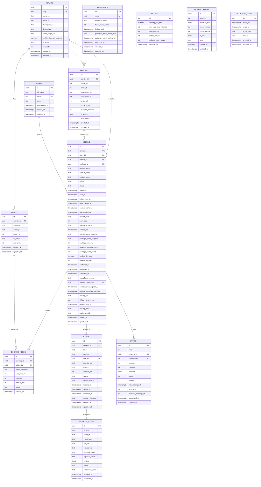
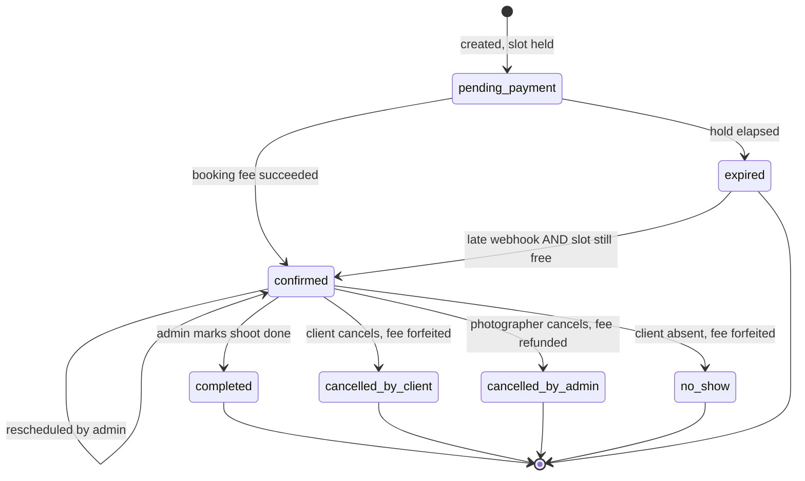
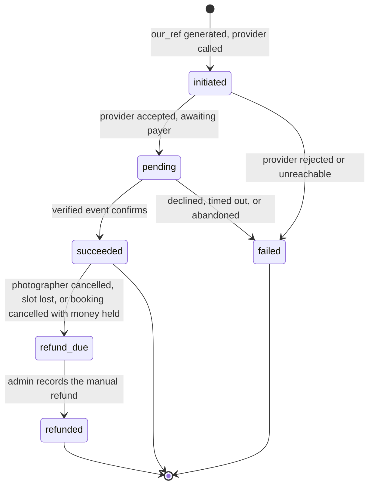

# Bookly — Data Model (v2)

| | |
|---|---|
| **Expands** | `specs_v2.md` §5. Behaviour is the spec's; storage is this document's. |
| **Supersedes** | `data-model.md` (v1). That version had ten defects (§1); this one fixes them. |
| **Target engine** | PostgreSQL 15+ (GiST exclusion constraints — §9.1) |
| **Access layer** | Prisma. Tables and relations live in `schema.prisma`; every constraint Prisma's DSL cannot express lives in hand-edited migration SQL (§2.1). |
| **Conventions** | UTC `timestamptz` · whole-RWF integers · UUID v4 primary keys |
| **Status** | **13 tables**. No production data exists, so this replaces v1 outright rather than migrating to it. |
| **Revision** | 2.1 — audit fixes: three NOT NULL/erasure conflicts, the totals bug, the payment-state contradiction, consent storage, and six simplifications (§14). |

---

## 1. What changed from v1, and why

| # | v1 defect | v2 fix |
|---|---|---|
| 1 | `total_rwf` excluded post-shoot add-ons, so no column held what a booking was actually worth | Totals are **never stored**. `bookingTotals()` (§6.1) computes quoted total, grand total, collected, refund-due and outstanding from immutable parts. |
| 2 | `session_fee_rwf` was mutable money guarded only by application code | Column removed. What is owed is derived; what was contracted is frozen on `payment.amount_rwf` at initiation. |
| 3 | `provider_ref NOT NULL UNIQUE` cannot hold MTN's `X-Reference-Id`, which **we** generate before the provider replies | Split into `our_ref` (uuid, ours, `NOT NULL UNIQUE`) and `provider_ref` (theirs, nullable, partial unique). |
| 4 | "Unique `provider_ref` makes webhooks idempotent" was wrong — providers send many events per transaction, retried and out of order | New `webhook_event` table keyed on `(provider, event_id)`, plus a terminal-status guard (§7.3). |
| 5 | Two successful booking-fee payments were representable | Partial unique index on `(booking_id) WHERE kind = 'booking_fee' AND status = 'succeeded'`. Session fees stay many-per-booking, as spec §6.15 requires. |
| 6 | No way to open a single Saturday — `availability_block` only subtracts | `working_hours` gains `effective_date`: a dated row overrides the weekly rule for one date, in either direction (§5.2). |
| 7 | `setting.payment_provider` was editable from the admin UI | Removed from the database. Provider selection is deploy configuration (§4.2). |
| 8 | Retry state lived as three columns on `booking`, serving Google Calendar only; email had no retry at all | New `outbox` table serving both, which also **replaces** `notification_log` — a sent message and a queued message are the same row at different times (§8.2). |
| 9 | Client contact details were mutable and unsnapshotted, alone among all values shown to a client | `contact_name`, `contact_email`, `contact_phone` snapshot onto `booking`. `client` becomes a pure dedupe/link record. |
| 10 | Over-modelled: a table and columns nothing read | Six trims (§11). `booking_invite`, `delivery`, `booking_access_token` and `notification_log` are gone as tables. |

**One reversal.** The v1 critique proposed a `booking_line_item` table. That is the wrong fix here: a package is exactly one per booking and drives scheduling, so it is not a peer of add-ons, and making it one costs a polymorphic table plus a partial unique index to re-impose "exactly one." The actual defect was that no total included post-shoot add-ons. A view fixes that with no new table (§6.1).

---

## 2. Conventions

| Rule | Decision |
|---|---|
| **Primary keys** | `uuid`, database-generated. Booking ids reach URLs and must not be enumerable. |
| **Naming** | `snake_case`, singular tables, `_id` foreign keys, `_at` timestamps, `is_` booleans. |
| **Timestamps** | `timestamptz`, stored UTC, rendered `Africa/Kigali` (spec §6.5). Every table has `created_at`; mutable tables have `updated_at`. |
| **Wall-clock times** | `working_hours.opens_minute` / `closes_minute` are **minutes since midnight** (0–1440) in Kigali local time, not `time` values. No DST, so the +02:00 offset is constant and conversion is lossless. Integers rather than `time` because Prisma maps `@db.Time` to a JavaScript `Date` with a meaningless date part, which invites exactly the class of bug this model exists to prevent. |
| **Money** | `integer`, whole RWF. No `float`, no `numeric` amounts, no `money` type. |
| **Rates** | `numeric(4,3)`, `CHECK (>= 0 AND <= 1)`. |
| **Enumerations** | `text` + `CHECK`, not native `enum`. Adding `offline_momo` under **R-1** is then one line, not an `ALTER TYPE` that locks and will not roll back in a transaction. |
| **Derived money** | Never stored. Amounts are either **immutable facts** (`package_price_rwf`, `payment.amount_rwf`) or **computed from facts** by one function (§6.1). Nothing recomputes a historic amount from a live catalogue row. |
| **Deletion** | Catalogue rows soft-delete via `is_active`. Bookings, payments and outbox rows are never deleted. Personal data is erased by anonymisation (§10.3). |
| **1:1 folding** | Where a relationship is strictly one-to-one and lifecycle-bound (delivery, access token), the columns live on `booking`. A join that can never return more than one row is not worth a table. `booking` is therefore wide and flat — a deliberate trade (§5.9). |

### 2.1 What Prisma can and cannot express

Prisma owns the tables, columns and relations. It owns none of the guarantees. Every rule that actually protects the business is written as SQL inside a migration, and Prisma is unaware it exists — which is safe, because the database enforces it regardless of which client connects.

| Requirement | Where it lives |
|---|---|
| Tables, columns, types, relations, plain indexes, plain unique constraints | `schema.prisma` |
| `EXCLUDE USING gist` overlap constraint (§9.1) | Migration SQL |
| The **four** partial unique indexes (§9.3) | Migration SQL |
| `CHECK` constraints — every enumeration, every non-negative amount, `id = 1`, `amount_rwf = unit_price_rwf * quantity` | Migration SQL |
| Functional unique index on `lower(email)` | Migration SQL |
| GiST index on `availability_block` ranges | Migration SQL |

Three operating rules follow, and they are not optional:

1. **`prisma migrate dev --create-only`, then edit the generated SQL** before applying. A migration created any other way silently omits every constraint above.
2. **`prisma db push` is forbidden in every environment.** It reconciles the database to `schema.prisma` and will drop constraints and indexes that Prisma does not know about — including the one that prevents double booking.
3. **A schema test asserts the constraints exist** (§9.1 verification). Prisma cannot tell you they went missing; a query against `pg_constraint` can.

Two type mappings worth naming: `numeric(4,3)` rate columns are `Decimal @db.Decimal(4, 3)` and arrive in JavaScript as `Decimal` objects, never `number`; `jsonb` columns are `Json`. Money is `Int` throughout, so no amount ever touches `Decimal`.

---

## 3. Subsystems

| Subsystem | Tables | Owns |
|---|---|---|
| **Identity & configuration** | `admin_user`, `setting` | The single login; every tunable operating value |
| **Availability** | `working_hours`, `availability_block` | What time is offerable |
| **Catalogue** | `service`, `package`, `addon` | What is sold, and for how much |
| **Booking** | `client`, `booking`, `booking_addon` | Who reserved what, at what captured price |
| **Money** | `payment`, `webhook_event` | Every collection attempt, and every provider event about one |
| **Work queue & audit** | `outbox` | Everything the system must send, and the record that it did |

---

## 4. Comprehensive ER diagram



`SETTING`, `WORKING_HOURS` and `AVAILABILITY_BLOCK` carry no foreign keys. There is exactly one admin (spec §2.1), so an `admin_user_id` on availability rows would model a second photographer the spec forbids, at the cost of a join predicate in every availability query. `WEBHOOK_EVENT` is matched to `PAYMENT` on `our_ref`/`provider_ref` in application code, **not** by a foreign key: an event can arrive that matches no payment (a stray callback, a spoofed post, a transaction from another environment), and that event must still be stored and inspectable rather than rejected at the database.

---

## 5. Table reference

### 5.1 `admin_user`

One row. The photographer.

**No TOTP, no `session_epoch`.** Both were invented — neither the brief nor the client's answers mention admin security at all. For a single user, "log out everywhere" is closing one browser, and a changed password already invalidates every admin token, because each carries an HMAC fingerprint of the password hash (spec §7). Argon2id plus the lockout in §5.1 is proportionate.

| Column | Type | Null | Default | Notes |
|---|---|:---:|---|---|
| `id` | uuid | no | `gen_random_uuid()` | |
| `email` | text | no | | Unique on `lower(email)` |
| `password_hash` | text | no | | Argon2id. Never logged, never serialised by any endpoint. |
| `failed_login_count` | int | no | `0` | Zeroed on success |
| `locked_until` | timestamptz | yes | `null` | Rising lockout (spec §6.23) |
| `password_reset_token_hash` | text | yes | `null` | Single-use, hashed, cleared on use |
| `password_reset_expires_at` | timestamptz | yes | `null` | |
| `last_login_at` | timestamptz | yes | `null` | |

### 5.2 `setting`

One row, `CHECK (id = 1)`. Typed columns, not key/value text — these values drive money and availability arithmetic.

| Column | Type | Default | Constraint |
|---|---|---|---|
| `id` | int | `1` | `CHECK (id = 1)` |
| `booking_fee_rate` | numeric(4,3) | `0.400` | `>= 0 AND <= 1` |
| `min_lead_time_minutes` | int | `120` | `>= 0` |
| `hold_minutes` | int | `30` | `> 0` |
| `buffer_minutes` | int | `30` | `>= 0` |
| `delivery_expiry_days` | int | `90` | `> 0` |

Five values, all reachable from the admin settings screen (spec P-30). `slot_granularity_minutes` (30) and `access_token_lifetime_days` (365) are **application constants**, not rows: nothing asks for them to be changeable, and a setting with no screen behind it is a column that drifts from the code that reads it.

**`payment_provider` is not here.** Provider selection is an environment variable read at boot. A dropdown that switches payment gateways mid-flight, reachable by permission P-30, would orphan in-flight payments to the wrong webhook handler. The cutover is a deploy, not a setting.

### 5.3 `working_hours`

Both the recurring weekly rule and dated overrides — the fix for v1 defect #6.

| Column | Type | Null | Default | Notes |
|---|---|:---:|---|---|
| `id` | uuid | no | | |
| `weekday` | int | yes | `null` | `0` = Sunday … `6` = Saturday. Set for a recurring rule. |
| `effective_date` | date | yes | `null` | Set for a one-off override of a single date. |
| `opens_minute` | int | yes | `null` | Minutes since midnight, Kigali wall time. `CHECK (BETWEEN 0 AND 1440)`. 09:00 = `540`. |
| `closes_minute` | int | yes | `null` | `CHECK (BETWEEN 0 AND 1440)`. 17:00 = `1020`. |
| `is_open` | bool | no | `true` | `false` + `effective_date` = closed that date entirely |
| `note` | text | yes | `null` | "Mukamana wedding — open Saturday" |

Constraints:

- `CHECK ((weekday IS NOT NULL) <> (effective_date IS NOT NULL))` — a row is recurring or dated, never both.
- `CHECK (is_open = false OR (opens_minute IS NOT NULL AND closes_minute IS NOT NULL AND closes_minute > opens_minute))`
- Unique `(weekday) WHERE effective_date IS NULL`
- Unique `(effective_date) WHERE weekday IS NULL`

**Resolution for a given date:** if a dated row exists it wins outright; otherwise the weekday row applies; otherwise the day is closed. One dated row opens a Saturday that has no weekly rule, and one dated row with `is_open = false` closes a Tuesday that does — both directions, one mechanism.

A day with a closed midday (morning and afternoon windows) is still not representable; it needs the unique constraints relaxed to include `opens_minute`. Not required by the spec, and named here because it is the likeliest next request.

### 5.4 `availability_block`

Subtractive, arbitrary ranges. Blocks may overlap each other and may overlap bookings — overlap is information, not an error (spec §6.4).

| Column | Type | Null | Default | Notes |
|---|---|:---:|---|---|
| `id` | uuid | no | | |
| `starts_at` | timestamptz | no | | |
| `ends_at` | timestamptz | no | | `CHECK (ends_at > starts_at)` |
| `is_all_day` | bool | no | `false` | Presentation only. The stored range is absolute, so availability logic never special-cases it. |
| `reason` | text | yes | `null` | Private (P-03). Never serialised to a public endpoint. |

A multi-day absence is one row, not one row per day.

### 5.5 `service`

| Column | Type | Null | Default | Notes |
|---|---|:---:|---|---|
| `id` | uuid | no | | |
| `slug` | text | no | | Unique; URL segment |
| `name_en` | text | no | | |
| `name_fr`, `description_en`, `description_fr` | text | yes | `null` | FR present and unwritten in v1 (spec §5.3 rule 8) |
| `cover_image_url` | text | yes | `null` | |
| `booking_fee_rate_override` | numeric(4,3) | yes | `null` | `null` = use `setting.booking_fee_rate` |
| `is_active` | bool | no | `true` | |
| `sort_order` | int | no | `0` | |

### 5.6 `package`

| Column | Type | Null | Default | Notes |
|---|---|:---:|---|---|
| `id` | uuid | no | | |
| `service_id` | uuid | no | | FK → `service`, `ON DELETE RESTRICT` |
| `name_en` | text | no | | |
| `name_fr`, `description_en`, `description_fr` | text | yes | `null` | |
| `price_rwf` | int | no | | `CHECK (>= 0)` |
| `photo_count` | int | no | | `CHECK (>= 0)` |
| `duration_minutes` | int | no | | `CHECK (> 0)`. Drives slot length and `booking.ends_at`. |
| `is_active` | bool | no | `true` | |
| `sort_order` | int | no | `0` | |

A package longer than the widest open window can never produce a slot (spec §6.8). The admin UI warns on save when `duration_minutes` exceeds `max(closes_minute - opens_minute)` across open days.

### 5.7 `addon`

| Column | Type | Null | Default | Notes |
|---|---|:---:|---|---|
| `id` | uuid | no | | |
| `service_id` | uuid | yes | `null` | FK → `service`. `null` = offered on every service. |
| `name_en` | text | no | | |
| `name_fr` | text | yes | `null` | |
| `price_rwf` | int | no | | `CHECK (>= 0)` |
| `is_active` | bool | no | `true` | |
| `sort_order` | int | no | `0` | |

Every active add-on is both client-selectable at booking and admin-addable after the shoot. v1's `is_client_selectable` split was not asked for and is gone (§11).

### 5.8 `client`

A dedupe and linking record. **Not** an account: it holds no credential and grants no access.

| Column | Type | Null | Default | Notes |
|---|---|:---:|---|---|
| `id` | uuid | no | | |
| `full_name` | text | no | | Latest known name |
| `email` | text | no | | Unique on `lower(email)` |
| `phone` | text | yes | | Latest known number, E.164 where parseable. **Nullable** because erasure nulls it (§10.2); as `NOT NULL` the erasure routine raised `23502`. |
| `anonymized_at` | timestamptz | yes | `null` | Set by the erasure routine (§10.3) |

These three fields are *current* values, used to prefill a returning client's form. What a given booking was made with lives on the booking (§5.9) — changing a phone number here never rewrites history.

### 5.9 `booking`

Wide and flat by design: it absorbs the delivery record and the access token, both strictly 1:1 and lifecycle-bound.

**Identity and contact**

| Column | Type | Null | Default | Notes |
|---|---|:---:|---|---|
| `id` | uuid | no | | Never in a client-facing URL — the access token addresses the booking |
| `reference` | text | no | | Unique. `BKY-YYMM-XXXXX`, Crockford base32 (no I/L/O/U). Retry on collision. |
| `client_id` | uuid | no | | FK → `client`, `ON DELETE RESTRICT` |
| `contact_name` | text | no | | **Snapshot** at booking time (fix #9) |
| `contact_email` | text | no | | Snapshot. Every email for this booking goes here, not to the live client row. |
| `contact_phone` | text | no | | Snapshot |
| `locale` | text | no | `'en'` | `IN ('en','fr')`. Language of every message for this booking. |

**Catalogue and snapshots**

| Column | Type | Null | Notes |
|---|---|:---:|---|
| `service_id` | uuid | no | FK → `service`, `RESTRICT` |
| `package_id` | uuid | no | FK → `package`, `RESTRICT`. Drives scheduling; the money is in the snapshots below. |
| `service_name_snapshot` | text | no | |
| `package_name_snapshot` | text | no | |
| `package_price_rwf` | int | no | The package's price at booking time. An immutable fact, not a total. |
| `package_duration_minutes` | int | no | Renders "2-hour session" correctly after the package changes |
| `package_photo_count` | int | no | Renders "20 photos" in the delivery email |

**Schedule**

| Column | Type | Null | Notes |
|---|---|:---:|---|
| `status` | text | no | §7.1. Default `pending_payment`. |
| `starts_at` | timestamptz | no | |
| `ends_at` | timestamptz | no | `= starts_at + package_duration_minutes`. `CHECK (ends_at > starts_at)` |
| `buffer_ends_at` | timestamptz | no | `= ends_at + setting.buffer_minutes` **at creation**. `CHECK (>= ends_at)`. Snapshotted so changing the setting never moves existing reservations. This is the column the exclusion constraint ranges over. **On reschedule it is recomputed** from the new `ends_at` and the buffer in force at that moment — leaving it stale would either hold time the booking no longer occupies or violate its own CHECK. |
| `hold_expires_at` | timestamptz | yes | `now() + hold_minutes` at creation; nulled on confirmation |
| `original_starts_at` | timestamptz | yes | Written on the **first** reschedule only, so the originally agreed time survives repeated moves |
| `rescheduled_at` | timestamptz | yes | Most recent move |

**Details, money quote, lifecycle**

| Column | Type | Null | Notes |
|---|---|:---:|---|
| `location_text` | text | no | |
| `party_size` | int | yes | `CHECK (> 0)`. Null is legitimate for a product shoot. |
| `special_requests` | text | yes | |
| `consent_at` | timestamptz | no | When the client ticked the consent box. Law N° 058/2021 requires consent to be **demonstrable**, not merely collected; without this column the checkbox proves nothing. |
| `booking_fee_rate` | numeric(4,3) | no | Resolved at creation: service override, else global |
| `booking_fee_rwf` | int | no | `round(quoted_total × booking_fee_rate)`, frozen at creation. The quote the client accepted. `CHECK (>= 0)` |
| `confirmed_at`, `completed_at`, `cancelled_at` | timestamptz | yes | |
| `cancellation_reason` | text | yes | Shown to the client when the admin cancels |

**There is no `total_rwf` and no `session_fee_rwf`.** Both are derived (§6.1).

**Access (folded from v1's `booking_access_token`)**

| Column | Type | Null | Notes |
|---|---|:---:|---|
| `access_token_hash` | text | yes | Unique. SHA-256 of a ≥128-bit random token. **The plaintext exists only in the email** — never stored, never logged, recoverable only by replacement. Generated at confirmation. |
| `access_token_expires_at` | timestamptz | yes | `confirmed_at + access_token_lifetime_days` (365) |
| `access_token_last_used_at` | timestamptz | yes | |

Resending overwrites the hash, which invalidates the previous link (spec §6.21). One live token per booking is now structural rather than enforced by a partial index. The cost is that prior tokens leave no trace; nothing in the spec asks for one.

**Delivery (folded from v1's `delivery` table)**

| Column | Type | Null | Notes |
|---|---|:---:|---|
| `delivery_url` | text | yes | The external host's link. `CHECK` it parses as https. |
| `delivery_expires_on` | date | yes | Defaults to `today + delivery_expiry_days` (90) when first set. Evaluated end-of-day Kigali. |
| `delivery_sent_at` | timestamptz | yes | Null until the delivery email goes out; a link can exist unsent |
| `delivery_note` | text | yes | Optional line in the delivery email; also holds the host name |

**No download tracking exists.** Under hybrid delivery (A-7 option C) the files sit on a third party, so the site cannot know whether anyone downloaded anything. `delivery_expires_on` is what the photographer *stated*; the real file lifetime belongs to the host. Download analytics require A-7 option A.

**Calendar**

| Column | Type | Null | Notes |
|---|---|:---:|---|
| `gcal_event_id` | text | yes | The mirrored event. Retry state lives in `outbox`, not here (fix #8). |

### 5.10 `booking_addon`

| Column | Type | Null | Default | Notes |
|---|---|:---:|---|---|
| `id` | uuid | no | | |
| `booking_id` | uuid | no | | FK → `booking`, `ON DELETE CASCADE` |
| `addon_id` | uuid | no | | FK → `addon`, `ON DELETE RESTRICT` |
| `name_snapshot` | text | no | | |
| `unit_price_rwf` | int | no | | `CHECK (>= 0)` |
| `quantity` | int | no | `1` | `CHECK (> 0)` |
| `amount_rwf` | int | no | | `CHECK (amount_rwf = unit_price_rwf * quantity)` — stored so the totals view sums one column |
| `stage` | text | no | | `IN ('at_booking','post_shoot')` |

`at_booking` rows are immutable once the booking is confirmed. `post_shoot` rows are editable until a session-fee payment for the booking reaches `succeeded` — enforced in the application, and made safe by the fact that the payment's own `amount_rwf` is frozen at initiation (§6.2).

### 5.11 `payment`

One row per collection attempt. Never edited except by its own state machine; never deleted.

| Column | Type | Null | Default | Notes |
|---|---|:---:|---|---|
| `id` | uuid | no | | |
| `booking_id` | uuid | no | | FK → `booking`, `ON DELETE RESTRICT` |
| `kind` | text | no | | `IN ('booking_fee','session_fee')` |
| `provider` | text | no | | `IN ('mtn_momo_direct','flutterwave')`. Frozen at creation so records survive the cutover (spec §6.18). |
| `our_ref` | uuid | no | `gen_random_uuid()` | **Unique.** Generated by us before the provider is called. This is MTN's `X-Reference-Id` and Flutterwave's `tx_ref`. It exists from the first instant, so an attempt that never reaches the provider is still recorded. |
| `provider_ref` | text | yes | `null` | The provider's own id, filled in when it answers. Partial unique `WHERE provider_ref IS NOT NULL`. |
| `method` | text | yes | `null` | `IN ('momo_mtn','momo_airtel','card')`. Null until the provider reports what the payer chose. |
| `amount_rwf` | int | no | | `CHECK (> 0)`. **Frozen at initiation** — this is the contracted amount, and the reason nothing needs to lock `session_fee_rwf`. Gateway fees are absorbed and never modelled here. |
| `status` | text | no | `'initiated'` | §7.2 |
| `failure_reason` | text | yes | `null` | Provider decline text, for answering "why did my payment fail" |
| `initiated_at` | timestamptz | no | `now()` | |
| `settled_at`, `refunded_at` | timestamptz | yes | `null` | |
| `refund_reference` | text | yes | `null` | MoMo/bank reference typed in by the admin (spec §6.16) |

Raw provider payloads are **not** here — they live on `webhook_event` (§5.12), one place with one retention rule.

**The system never moves money.** No column triggers a transfer. `refund_due` is a task for the photographer; `refunded` is his record of having done it by hand.

### 5.12 `webhook_event`

Every inbound provider callback, stored before it is interpreted. The fix for v1 defect #4.

| Column | Type | Null | Default | Notes |
|---|---|:---:|---|---|
| `id` | uuid | no | | |
| `provider` | text | no | | `IN ('mtn_momo_direct','flutterwave')` |
| `event_id` | text | no | | The provider's own event/notification id. **Unique with `provider`** — this, not `provider_ref`, is what makes delivery idempotent. |
| `event_type` | text | no | | Provider's raw type string |
| `our_ref` | uuid | yes | `null` | Parsed from the payload; the primary match key onto `payment` |
| `provider_ref` | text | yes | `null` | Secondary match key |
| `reported_status` | text | yes | `null` | The payment status this event asserts, normalised to our vocabulary |
| `signature_valid` | bool | no | | Stored, not assumed. Events failing verification are **recorded and not applied**. |
| `payload` | jsonb | yes | | Verbatim body, for dispute evidence. **Nullable** because erasure nulls it (§10.2). |
| `status` | text | no | `'received'` | `IN ('received','applied','ignored','failed')` |
| `processing_error` | text | yes | `null` | |
| `received_at` | timestamptz | no | `now()` | |
| `processed_at` | timestamptz | yes | `null` | |

`ignored` is a first-class outcome: a duplicate delivery, an out-of-order event, or one matching no payment. All three are stored and visible rather than silently dropped.

### 5.13 `outbox`

One queue and one audit trail for everything the system sends. Replaces v1's `notification_log` and the three `gcal_*` columns — a queued message and a sent message are the same row at different times.

| Column | Type | Null | Default | Notes |
|---|---|:---:|---|---|
| `id` | uuid | no | | |
| `kind` | text | no | | `IN ('email','gcal_create','gcal_update','gcal_delete')`. `sms` and `whatsapp` are addable without migration when A-12 phase 2 arrives. |
| `booking_id` | uuid | yes | `null` | FK → `booking`, `ON DELETE RESTRICT`. Null for admin alerts and offline booking-link invites. |
| `dedupe_key` | text | no | | **Unique.** e.g. `email:booking_confirmation:<booking_id>`. Makes "send exactly once" a database guarantee rather than a hope. |
| `template` | text | yes | `null` | `booking_confirmation`, `admin_new_booking`, `session_fee_request`, `payment_receipt`, `photo_delivery`, `cancellation`, `reschedule`, `access_link_resend`, `admin_alert`. Null for calendar jobs. `admin_alert` is the catch-all for everything addressed to the photographer — a new booking's payment received, an exhausted retry, a login lockout, a payment needing a refund. |
| `recipient` | text | yes | `null` | Null for calendar jobs |
| `payload` | jsonb | yes | | Everything the worker needs, resolved at enqueue time. **Nullable** because erasure nulls it (§10.2). |
| `status` | text | no | `'pending'` | `IN ('pending','processing','done','failed','cancelled')` |
| `attempts` | int | no | `0` | |
| `next_attempt_at` | timestamptz | no | `now()` | Exponential backoff. The worker claims rows where `status = 'pending' AND next_attempt_at <= now()`. |
| `last_error` | text | yes | `null` | Surfaced in the admin alert when attempts are exhausted (spec §6.17) |
| `provider_message_id` | text | yes | `null` | Email provider's id, for tracing a bounce |
| `completed_at` | timestamptz | yes | `null` | |

The admin's per-booking message history is `SELECT … WHERE booking_id = $1 AND kind = 'email' ORDER BY created_at`. Resending is a new row with a new `dedupe_key` suffix, never an edit.

---

## 6. Derived money

### 6.1 Booking totals — one function, not a view

There is no `booking_totals` view. Totals are computed by a single exported function and by nothing else:

```
bookingTotals(booking, addons, payments) -> {
  quotedTotalRwf, grandTotalRwf, collectedRwf, refundDueRwf, outstandingRwf
}
```

| Value | Rule |
|---|---|
| `quotedTotalRwf` | `package_price_rwf` + Σ addons where `stage = 'at_booking'` |
| `grandTotalRwf` | `quotedTotalRwf` + Σ addons where `stage = 'post_shoot'` |
| `collectedRwf` | Σ payments where `status = 'succeeded'` |
| `refundDueRwf` | Σ payments where `status = 'refund_due'` — money held that is owed **back** |
| `outstandingRwf` | **Depends on booking status** (below) |

**Outstanding is status-aware.** The v2.0 view computed `grand_total − collected` unconditionally, which reported the session fee as outstanding on a `no_show` — contradicting spec §6.12, which says no session fee is owed — and made `outstanding` *jump* the moment a payment moved to `refund_due`, because that status leaves `collected`. Both were wrong:

| Booking status | `outstandingRwf` |
|---|---|
| `pending_payment`, `confirmed`, `completed` | `grandTotalRwf − collectedRwf` |
| `no_show`, `cancelled_by_client` | **0** — the fee is forfeited and nothing further is owed (spec §6.10, §6.12) |
| `cancelled_by_admin` | **0** owed by the client. `refundDueRwf` is what is owed **to** them (spec §6.11) |
| `expired` | **0** — no booking exists to owe against |

Three properties worth naming:

- **`grandTotalRwf` includes post-shoot add-ons.** Revenue reporting sums this and cannot silently under-report.
- **`collectedRwf` counts only `succeeded`**, and `refundDueRwf` is reported separately rather than being netted off — a refund owed is not the same fact as a refund made.
- **`booking_fee_rwf` stays a stored column**, because it is the quote the client accepted before any payment row existed. It is a fact, not a derivation.

A function rather than a view because the status logic above is conditional, the numbers are needed in TypeScript on every page that shows them, and a view would have to be read through `$queryRaw` with a hand-maintained row type sitting outside Prisma's type system. Spec §4.2 excludes the revenue dashboard that would have justified SQL-level reporting.

### 6.2 Money invariants

| Invariant | Enforced by |
|---|---|
| Booking fee equals the quoted rate applied to the quoted total | Application, at creation; both inputs are then frozen |
| A booking has at most one succeeded booking-fee payment | Partial unique index (§9.3) |
| A booking may have several succeeded session-fee payments | No constraint — spec §6.15 requires it |
| What a client is charged never changes after they reach checkout | `payment.amount_rwf` is written at initiation and never updated |
| Editing an add-on after full payment creates a new charge, never a mutation | Application; a second `session_fee` payment row (spec §6.15) |
| Rounding never loses a franc | Only the booking fee rounds (half-up); the session fee is the remainder by subtraction |

---

## 7. State machines

### 7.1 Booking



Occupancy by status — **this table and the exclusion constraint's predicate (§9.1) must agree, and a test asserts it**, because adding a status without updating the predicate would silently free occupied time:

| Status | Occupies the slot | In the exclusion predicate |
|---|---|:---:|
| `pending_payment` | Yes, until `hold_expires_at` | ✓ |
| `confirmed` | Yes | ✓ |
| `completed` | Yes — the time was consumed | ✓ |
| `no_show` | Yes — the time was consumed (spec §6.12) | ✓ |
| `expired` | No | — |
| `cancelled_by_client` | No | — |
| `cancelled_by_admin` | No | — |

### 7.2 Payment



### 7.3 Applying a webhook

Providers retry events and deliver them out of order. One rule handles both, and it is stated as a rule about **terminal statuses**, not a rank ladder:

1. **Verify the signature.** Invalid → store with `signature_valid = false`, status `ignored`, apply nothing, return 200.
2. **`INSERT` the `webhook_event`.** A unique violation on `(provider, event_id)` is a duplicate delivery → `ignored`, stop.
3. **Match a payment** on `our_ref`, else `provider_ref`. No match → `ignored`, stop; the row stays for inspection.
4. **If the payment is already terminal — `succeeded`, `failed` or `refunded` — ignore the event.** This single guard replaces the four-rank ladder v2.0 carried. That ladder ranked `failed` below `succeeded`, which contradicted §7.2 making `failed` terminal and would have let a stray event resurrect a dead payment. A failed MoMo attempt is its own transaction with its own `our_ref`; it never becomes a success.
5. **Otherwise apply** the reported transition inside a transaction with the booking-state change it implies, and mark `applied`.

`refund_due` and `refunded` are admin-driven (spec §6.16), never provider-driven. A webhook never sets them.

---

## 8. Availability resolution

Order of operations for a given date and package:

1. **Open window** — the `working_hours` row for that `effective_date` if one exists; otherwise the row for that `weekday`; otherwise closed. `is_open = false` ends the evaluation.
2. **Subtract blocks** — every `availability_block` range overlapping the window.
3. **Subtract occupancy** — every booking in an occupying status (§7.1), through its `buffer_ends_at`, not its `ends_at`.
4. **Apply lead time** — discard starts earlier than `now() + min_lead_time_minutes`.
5. **Grid and fit** — keep starts on the `slot_granularity_minutes` grid where the whole `package_duration_minutes` fits before `closes_minute`.

The trailing buffer belongs to the booking that created it, so exactly one buffer sits between two adjacent shoots. A buffer running past `closes_minute` blocks nothing, since there is nothing after closing to block.

---

## 9. Constraints, indexes, and the claim transaction

### 9.1 The constraint the project exists for

```sql
ALTER TABLE booking ADD CONSTRAINT booking_no_overlap
  EXCLUDE USING gist (tstzrange(starts_at, buffer_ends_at, '[)') WITH &&)
  WHERE (status IN ('pending_payment', 'confirmed', 'completed', 'no_show'));
```

Two bookings with overlapping reserved ranges cannot both exist, whatever the application does. The range runs to `buffer_ends_at`, so the buffer is protected by the same mechanism as the shoot. Cancelled and expired bookings leave the predicate and stop occupying time the instant their status changes.

No `btree_gist` extension is needed today because the constraint ranges over one expression. A second photographer later (`EXCLUDE … admin_user_id WITH =, range WITH &&`) would require it.

### 9.2 The stale-hold race

The predicate cannot call `now()`, so a `pending_payment` row whose hold has lapsed still occupies its range until something flips it to `expired`. A client claiming that slot in the gap would be rejected on behalf of a dead hold. The claim transaction therefore expires stale holds itself:

1. `BEGIN`
2. `UPDATE booking SET status = 'expired' WHERE status = 'pending_payment' AND hold_expires_at <= now() AND tstzrange(starts_at, buffer_ends_at) && <requested range>`
3. `INSERT` the new booking — the constraint now sees only live occupancy
4. On exclusion violation: `ROLLBACK`, return "this slot was just taken" (spec §6.1)
5. `COMMIT`

The sweeper job still runs every minute for tidiness. Correctness does not depend on its cadence.

### 9.3 Indexes

| Index | Table | Purpose |
|---|---|---|
| `EXCLUDE … gist` (§9.1) | `booking` | Overlap prevention; also serves range lookups |
| `(status, starts_at)` | `booking` | Calendar and availability queries |
| `(client_id, starts_at DESC)` | `booking` | "This client's history" in the admin — missing in v1 |
| `(hold_expires_at) WHERE status = 'pending_payment'` | `booking` | Sweeper and claim step 2 |
| unique `(reference)` | `booking` | Quoting a reference by phone |
| unique `(access_token_hash)` | `booking` | Every client page load |
| unique `lower(email)` | `client` | Deduplication at booking |
| unique `(our_ref)` | `payment` | Our idempotency key; the provider callback's match key |
| unique `(provider_ref) WHERE provider_ref IS NOT NULL` | `payment` | **Partial unique 1 of 4.** Their id, once it exists |
| unique `(booking_id) WHERE kind = 'booking_fee' AND status = 'succeeded'` | `payment` | **Partial unique 2 of 4.** No double-charging the deposit |
| unique `(weekday) WHERE effective_date IS NULL` | `working_hours` | **Partial unique 3 of 4.** One recurring rule per weekday |
| unique `(effective_date) WHERE weekday IS NULL` | `working_hours` | **Partial unique 4 of 4.** One override per date |
| `(booking_id, kind, status)` | `payment` | "What is still owed" |
| unique `(provider, event_id)` | `webhook_event` | Delivery idempotency (fix #4) |
| `(our_ref)` | `webhook_event` | Matching an event to its payment |
| unique `(dedupe_key)` | `outbox` | Send-exactly-once |
| `(status, next_attempt_at) WHERE status IN ('pending','processing')` | `outbox` | Keeps the queue scan small as history grows. Partial, **not** unique |
| `(booking_id, created_at)` | `outbox` | Per-booking message history |
| `gist (tstzrange(starts_at, ends_at))` | `availability_block` | Subtracting blocks |

### 9.4 Referential behaviour

| Relationship | On delete | Why |
|---|---|---|
| `booking` → `service`, `package` | `RESTRICT` | A booked service deactivates, never deletes (spec §6.14) |
| `booking_addon` → `addon` | `RESTRICT` | Same |
| `booking` → `client` | `RESTRICT` | Clients are anonymised, not deleted |
| `booking_addon` → `booking` | `CASCADE` | Dependent detail with no standalone meaning |
| `payment`, `outbox` → `booking` | `RESTRICT` | Audit outlives everything |

### 9.5 Derived values computed at write time

| Value | Rule |
|---|---|
| `ends_at` | `starts_at + package.duration_minutes` |
| `buffer_ends_at` | `ends_at + setting.buffer_minutes` |
| `booking_fee_rate` | `service.booking_fee_rate_override` if set, else `setting.booking_fee_rate` |
| `booking_fee_rwf` | `round(quoted_total × booking_fee_rate)`, half-up, whole RWF |
| `booking_addon.amount_rwf` | `unit_price_rwf × quantity`, `CHECK`-enforced |
| Everything else about money | Computed by `bookingTotals()` (§6.1), never stored |

---

## 10. Lifecycle and retention

### 10.1 What is never deleted

`booking`, `payment`, `webhook_event` and `outbox` rows are permanent. Status carries meaning that deletion would destroy.

### 10.2 Personal data erasure

There are **no scheduled purge jobs.** v2.0 specified three retention windows (12 months, 24 months, 90 days) with boundary tests, against a database that holds a few thousand rows after five years. Scheduled purging is not a legal obligation; erasure on request is, and it is built. Bounded growth can be revisited if the row count ever justifies a cron job.

Law N° 058/2021 obliges deletion on request (spec §7); financial records must survive. Erasure is therefore anonymisation, and every column it touches is nullable **because** it touches it (§5.8, §5.12, §5.13):

1. `client` — `full_name` → `'Erased client'`, `email` → `erased+<uuid>@bookly.invalid`, `phone` → `null`, `anonymized_at` → `now()`.
2. `booking` — `contact_name`, `contact_email`, `contact_phone`, `location_text` → `'[erased]'`; `special_requests` → `null`; `access_token_hash` → `null` (every link dies); `delivery_url` → `null`. `consent_at` is **kept** — it is the record that consent was given, and erasing it would destroy the evidence the law asks you to hold.
3. `payment` — untouched. It holds no personal data by design.
4. `webhook_event.payload` → `null` for that client's payments.
5. `outbox` — `recipient` → `'[erased]'`, `payload` → `null` for their rows.

Runs in a single transaction: a partial erasure is not a possible outcome. Amounts, dates, statuses and snapshots survive, so revenue history and the audit trail stay intact.

**Deleting the photos themselves is manual work on the external host** — the site can only stop pointing at them. That belongs in the privacy notice rather than being implied away.

---

## 11. Trims from v1, and what is lost

| Removed | What is lost | Why it goes |
|---|---|---|
| `booking_invite` table | Funnel tracking: who opened an invite, which converted | v2.0 replaced the table with a stateless signed URL; revision 2.1 removed that too (§11.1). An offline enquiry is answered by sending the public booking URL by hand — WhatsApp already does this, and R-1 never confirmed anyone would follow such a link at all. |
| `delivery` table | Nothing | Strictly 1:1 with `booking`. Four columns replace a table and a join. |
| `booking_access_token` table | History of superseded tokens | Strictly 1:1 in practice. Three columns replace a table, a partial unique index and a `revoked_at` lifecycle. |
| `notification_log` table | Nothing | `outbox` is the same rows with retry state attached (fix #8). |
| `client.marketing_consent` | Nothing | v1 admitted no code reads it. A newsletter that does not exist can add it. |
| `addon.is_client_selectable`, `addon.description_*`, `delivery.host_label` | Admin-only add-ons; add-on descriptions | Not in the spec. Add-ons are name plus price; the host name fits in `delivery_note`. |

**Net:** 15 tables → 13, with `webhook_event` and `outbox` added. Four tables folded or dropped, two added for correctness.

### 11.1 Removed in revision 2.1

No tables were added or removed. What went was machinery inside them.

| Removed | What is lost | Why it goes |
|---|---|---|
| `booking_totals` view | SQL-level reporting | Replaced by one function (§6.1) that can express the status-aware rules a view could not, and that lives inside Prisma's type system |
| The four-rank webhook ladder | Nothing | One terminal-status guard covers every case and does not contradict §7.2 (§7.3) |
| Scheduled purge jobs and three retention windows | Bounded growth on a table that grows a few thousand rows a decade | §10.2 |
| `admin_user.totp_secret`, `is_totp_enabled`, `session_epoch` | Two-factor; "log out everywhere" | One user, one browser. Untraceable to anything the client said |
| `working_hours.admin_user_id`, `availability_block.admin_user_id` | A second photographer | Spec §4.2 forbids one. Two FKs and a join predicate in every availability query for a role that cannot exist |
| `setting.slot_granularity_minutes`, `access_token_lifetime_days`, `invite_lifetime_days` | Configurability nobody asked for | Now constants, or gone with the invite flow. A setting with no screen behind it drifts from the code that reads it |
| The offline booking-invite link | Funnel tracking; a pre-filled URL | Sending the service page URL over WhatsApp does the same job in zero lines. R-1 was never confirmed as needed at all |

---

## 12. Open items that touch the schema

| Ref | If it changes | Impact |
|---|---|---|
| **R-1** — admin-created bookings | Option B chosen | `payment.method` gains `offline_cash`/`offline_momo`; `payment.provider` gains `offline`; `booking` gains `created_by_admin`. `CHECK`-based enums make this one line each. With the invite flow removed, an offline enquiry is now handled by sending the client the public booking URL by hand — so if that proves insufficient, this is the only remaining option. |
| **R-2** — French launch | French ships | No migration. `_fr` columns exist and are nullable, and the translation layer is in place. What was dropped in 2.1 is locale-prefixed routing and the no-hardcoded-strings rule, so enabling French means adding routes and filling files rather than a rebuild. |
| **R-3** — payment credentials | Flutterwave cutover | No migration. An environment variable changes; historic rows keep their own `provider`, and both webhook handlers stay mounted (spec §6.18). |
| **R-4** — weekday-only hours | Saturday work appears | **No migration.** One `working_hours` row with `effective_date` opens a single Saturday; a row with `weekday = 6` opens all of them. This is what v1 could not do. |
| **R-5** — refund execution | Flutterwave refund API used | `payment` gains `refund_provider_ref` beside the manual `refund_reference`. |
| **R-6** — launch content | Content arrives | Seed data only. |
| **A-12 phase 2** — SMS/WhatsApp | Either ships | `outbox.kind` gains `sms`/`whatsapp`. No new table, no new queue. |

---

## 13. Seed data

| Table | Rows |
|---|---|
| `admin_user` | 1 — created by the deploy script, forced password change on first login. No TOTP enrolment step. |
| `setting` | 1 — the five defaults in §5.2 |
| `working_hours` | 5 — `weekday` 1–5, `opens_minute = 540`, `closes_minute = 1020` (09:00–17:00), `is_open = true`. Saturday and Sunday have no rows, which closes them. **These hours were chosen by the developer, not stated by the photographer** — see spec R-4, and confirm before launch: the brief sells event coverage, and Kigali events fall on weekends. |
| `service`, `package`, `addon` | **None.** Blocked on **R-6**. The availability engine cannot be tested meaningfully without at least three packages of differing durations. |
