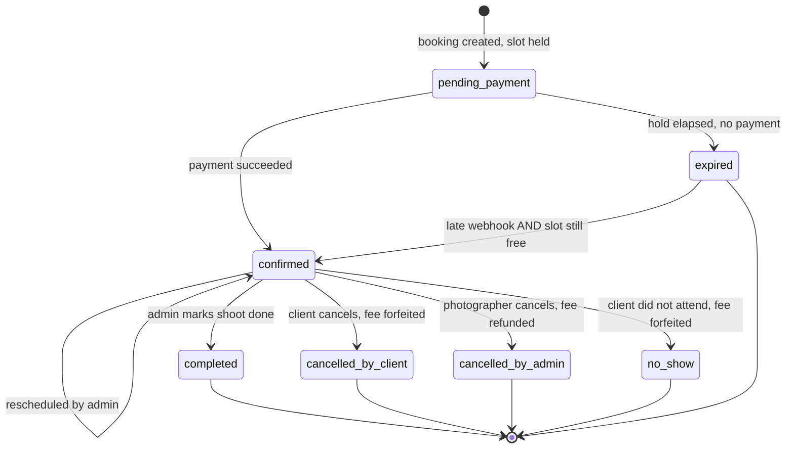
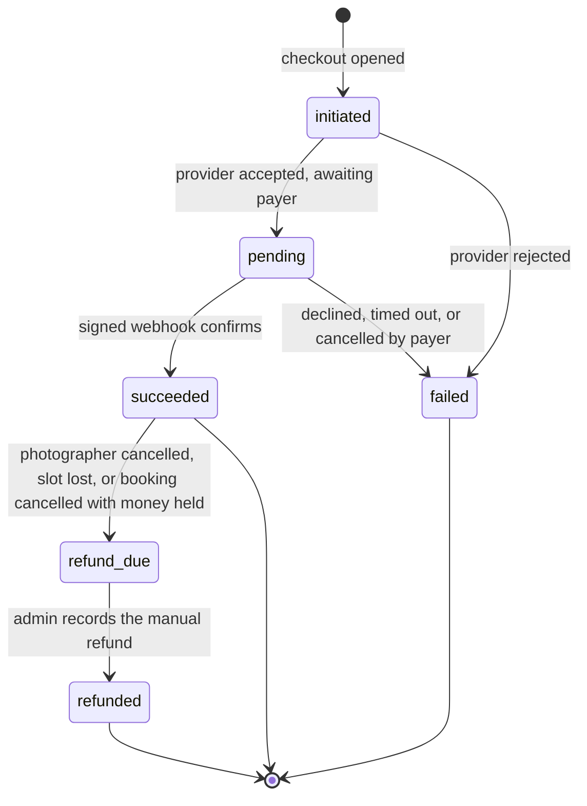

# Bookly — Data Model

| | |
|---|---|
| **Expands** | `specs_v2.md` §5. Where this document is more specific, it governs implementation; where it contradicts `specs_v2.md`, the spec governs behaviour and this document is wrong and must be corrected. |
| **Target engine** | PostgreSQL 15+ (chosen for GiST exclusion constraints — §7.1) |
| **Storage conventions** | UTC `timestamptz` · whole-RWF integers · UUID v4 primary keys |
| **Status** | 15 tables. Four deltas from `specs_v2.md` §5.1 (§10) and five new default values (§11) need a nod before build. |

---

## 1. Conventions

| Rule | Decision |
|---|---|
| **Primary keys** | `uuid`, generated by the database (`gen_random_uuid()`). No sequential integers — booking ids appear in URLs and must not be enumerable. |
| **Table and column names** | `snake_case`, singular table names, `_id` suffix on foreign keys, `_at` suffix on timestamps, `is_` prefix on booleans. |
| **Timestamps** | `timestamptz`, always UTC, always rendered in `Africa/Kigali` (spec §6.5). Every table carries `created_at`; mutable tables also carry `updated_at`. |
| **Wall-clock times** | `working_hours.opens_at` / `closes_at` are `time` values in Kigali local wall time, not UTC. Kigali has no DST, so the offset is a constant +02:00 and the conversion is total. |
| **Money** | `integer`, whole RWF. RWF has no minor unit. No `float`, no `money` type, no decimals for amounts. |
| **Rates** | `numeric(4,3)` (e.g. `0.400`), constrained to `>= 0 AND <= 1`. |
| **Enumerations** | `text` columns with `CHECK` constraints, **not** native Postgres `enum` types. Adding a value (e.g. `offline_momo` if **R-1** turns into option B) is then a one-line constraint change rather than an `ALTER TYPE` that locks and cannot be rolled back inside a transaction. |
| **Deletion** | Catalogue rows are soft-deleted via `is_active`. Bookings, payments and notifications are never deleted — status carries the meaning. Personal data is erased by anonymisation, not row deletion (§9.3). |
| **Snapshots** | Any value a client was shown or charged is copied onto the booking at write time. Live catalogue rows are never read to compute a historic amount (spec §5.3 rule 4). |

---

## 2. Subsystems

The 15 tables group into six areas. Nothing outside a subsystem writes to its tables directly.

| Subsystem | Tables | Owns |
|---|---|---|
| **Identity & configuration** | `admin_user`, `setting` | The single admin login and every tunable operating value |
| **Availability** | `working_hours`, `availability_block` | What time is offerable at all |
| **Catalogue** | `service`, `package`, `addon` | What can be bought and for how much |
| **Booking** | `client`, `booking`, `booking_addon`, `booking_invite`, `booking_access_token` | Who reserved what time, at what captured price, and how they get back in |
| **Money** | `payment` | Every attempt to collect or return money |
| **Delivery & comms** | `delivery`, `notification_log` | The photo handoff and the audit trail of everything sent |

---

## 3. Comprehensive ER diagram

```mermaid
erDiagram
    ADMIN_USER ||--o{ WORKING_HOURS : "defines"
    ADMIN_USER ||--o{ AVAILABILITY_BLOCK : "declares"
    ADMIN_USER ||--o{ BOOKING_INVITE : "sends"

    SERVICE ||--o{ PACKAGE : "offers"
    SERVICE ||--o{ ADDON : "offers"
    SERVICE ||--o{ BOOKING : "booked as"
    PACKAGE ||--o{ BOOKING : "priced by"

    CLIENT ||--o{ BOOKING : "places"
    CLIENT ||--o{ BOOKING_INVITE : "invited as"

    BOOKING_INVITE }o--|| SERVICE : "pre-selects"
    BOOKING_INVITE }o--o| PACKAGE : "pre-selects"
    BOOKING_INVITE ||--o| BOOKING : "converts to"

    BOOKING ||--o{ BOOKING_ADDON : "includes"
    ADDON ||--o{ BOOKING_ADDON : "selected as"
    BOOKING ||--o{ PAYMENT : "collected by"
    BOOKING ||--o| DELIVERY : "delivered via"
    BOOKING ||--o| BOOKING_ACCESS_TOKEN : "opened by"
    BOOKING ||--o{ NOTIFICATION_LOG : "triggers"
    BOOKING_INVITE ||--o{ NOTIFICATION_LOG : "triggers"

    ADMIN_USER {
        uuid id PK
        text email UK
        text password_hash
        text totp_secret
        bool is_totp_enabled
        int failed_login_count
        timestamptz locked_until
        text password_reset_token_hash
        timestamptz password_reset_expires_at
        timestamptz last_login_at
        timestamptz created_at
        timestamptz updated_at
    }

    SETTING {
        int id PK
        numeric booking_fee_rate
        int min_lead_time_minutes
        int hold_minutes
        int buffer_minutes
        int slot_granularity_minutes
        int delivery_expiry_days
        int access_token_lifetime_days
        int invite_lifetime_days
        text payment_provider
        timestamptz updated_at
    }

    WORKING_HOURS {
        uuid id PK
        uuid admin_user_id FK
        int weekday
        time opens_at
        time closes_at
        bool is_active
        timestamptz created_at
        timestamptz updated_at
    }

    AVAILABILITY_BLOCK {
        uuid id PK
        uuid admin_user_id FK
        timestamptz starts_at
        timestamptz ends_at
        bool is_all_day
        text reason
        timestamptz created_at
        timestamptz updated_at
    }

    SERVICE {
        uuid id PK
        text slug UK
        text name_en
        text name_fr
        text description_en
        text description_fr
        text cover_image_url
        numeric booking_fee_rate_override
        bool is_active
        int sort_order
        timestamptz created_at
        timestamptz updated_at
    }

    PACKAGE {
        uuid id PK
        uuid service_id FK
        text name_en
        text name_fr
        text description_en
        text description_fr
        int price_rwf
        int photo_count
        int duration_minutes
        bool is_active
        int sort_order
        timestamptz created_at
        timestamptz updated_at
    }

    ADDON {
        uuid id PK
        uuid service_id FK
        text name_en
        text name_fr
        text description_en
        text description_fr
        int price_rwf
        bool is_client_selectable
        bool is_active
        int sort_order
        timestamptz created_at
        timestamptz updated_at
    }

    CLIENT {
        uuid id PK
        text full_name
        text email UK
        text phone
        text locale
        bool marketing_consent
        timestamptz anonymized_at
        timestamptz created_at
        timestamptz updated_at
    }

    BOOKING {
        uuid id PK
        text reference UK
        uuid client_id FK
        uuid service_id FK
        uuid package_id FK
        text status
        timestamptz starts_at
        timestamptz ends_at
        timestamptz buffer_ends_at
        text location_text
        int party_size
        text special_requests
        text locale
        text service_name_snapshot
        text package_name_snapshot
        int package_price_rwf
        int package_duration_minutes
        int package_photo_count
        numeric booking_fee_rate
        int booking_fee_rwf
        int session_fee_rwf
        int total_rwf
        timestamptz hold_expires_at
        timestamptz confirmed_at
        timestamptz completed_at
        timestamptz original_starts_at
        timestamptz rescheduled_at
        timestamptz cancelled_at
        text cancellation_reason
        text gcal_event_id
        timestamptz gcal_synced_at
        int gcal_sync_attempts
        text gcal_last_error
        timestamptz created_at
        timestamptz updated_at
    }

    BOOKING_ADDON {
        uuid id PK
        uuid booking_id FK
        uuid addon_id FK
        text name_snapshot
        int price_rwf_snapshot
        int quantity
        text added_stage
        timestamptz created_at
    }

    BOOKING_INVITE {
        uuid id PK
        uuid admin_user_id FK
        uuid service_id FK
        uuid package_id FK
        uuid client_id FK
        uuid converted_booking_id FK
        text email
        text token_hash
        date suggested_date
        text note
        timestamptz expires_at
        timestamptz sent_at
        timestamptz opened_at
        timestamptz converted_at
        timestamptz created_at
    }

    BOOKING_ACCESS_TOKEN {
        uuid id PK
        uuid booking_id FK
        text token_hash UK
        timestamptz expires_at
        timestamptz last_used_at
        timestamptz revoked_at
        timestamptz created_at
    }

    PAYMENT {
        uuid id PK
        uuid booking_id FK
        text kind
        text provider
        text provider_ref UK
        text method
        int amount_rwf
        text status
        text failure_reason
        timestamptz initiated_at
        timestamptz settled_at
        timestamptz refunded_at
        text refund_reference
        jsonb raw_payload
        timestamptz created_at
        timestamptz updated_at
    }

    DELIVERY {
        uuid id PK
        uuid booking_id FK
        text external_url
        text host_label
        date expires_on
        timestamptz sent_at
        text note
        timestamptz created_at
        timestamptz updated_at
    }

    NOTIFICATION_LOG {
        uuid id PK
        uuid booking_id FK
        uuid booking_invite_id FK
        text template
        text channel
        text recipient
        text status
        text provider_message_id
        text failure_reason
        timestamptz sent_at
        timestamptz created_at
    }
```



`SETTING` carries no foreign keys: it is a single-row configuration table (§4.2), not a per-user record.

---

## 4. Identity & configuration

### 4.1 `admin_user`

One row. The photographer.

| Column | Type | Null | Default | Notes |
|---|---|:---:|---|---|
| `id` | uuid | no | `gen_random_uuid()` | |
| `email` | text | no | | Unique, lowercased on write. The login identifier. |
| `password_hash` | text | no | | Argon2id (spec §7). Never logged, never returned by any API. |
| `totp_secret` | text | yes | `null` | Encrypted at rest. Present only once 2FA is enrolled. |
| `is_totp_enabled` | bool | no | `false` | Enrolment is finished only when a first valid code has been verified. |
| `failed_login_count` | int | no | `0` | Reset to 0 on a successful login. |
| `locked_until` | timestamptz | yes | `null` | Rising lockout window (spec §6.23). |
| `password_reset_token_hash` | text | yes | `null` | Single-use, hashed. Cleared on use. |
| `password_reset_expires_at` | timestamptz | yes | `null` | |
| `last_login_at` | timestamptz | yes | `null` | |

### 4.2 `setting`

A **single row**, guarded by `CHECK (id = 1)`. Typed columns rather than key/value text pairs — these values drive money and availability arithmetic, and a `numeric` column cannot be handed a malformed string the way a `value text` column can (**delta D-4**).

| Column | Type | Null | Default | Constraint |
|---|---|:---:|---|---|
| `id` | int | no | `1` | `CHECK (id = 1)` |
| `booking_fee_rate` | numeric(4,3) | no | `0.400` | `>= 0 AND <= 1` |
| `min_lead_time_minutes` | int | no | `120` | `>= 0` |
| `hold_minutes` | int | no | `30` | `> 0` |
| `buffer_minutes` | int | no | `30` | `>= 0` |
| `slot_granularity_minutes` | int | no | `30` | `IN (15, 30, 60)` |
| `delivery_expiry_days` | int | no | `90` | `> 0` |
| `access_token_lifetime_days` | int | no | `365` | `> 0` — **new default, §11** |
| `invite_lifetime_days` | int | no | `14` | `> 0` — **new default, §11** |
| `payment_provider` | text | no | `'mtn_momo_direct'` | `IN ('mtn_momo_direct','flutterwave')` — the cutover switch (spec §4.3) |

---

## 5. Availability

### 5.1 `working_hours`

One row per bookable weekday. Seeded Mon–Fri 09:00–17:00; Saturday and Sunday have no rows (see **R-4**).

| Column | Type | Null | Default | Notes |
|---|---|:---:|---|---|
| `id` | uuid | no | | |
| `admin_user_id` | uuid | no | | FK → `admin_user`, `ON DELETE CASCADE` |
| `weekday` | int | no | | `0` = Sunday … `6` = Saturday. `CHECK (weekday BETWEEN 0 AND 6)` |
| `opens_at` | time | no | | Kigali wall time |
| `closes_at` | time | no | | `CHECK (closes_at > opens_at)` |
| `is_active` | bool | no | `true` | Deactivating a weekday is reversible; deleting the row is not |

One window per weekday. A split day (morning and afternoon with a closed midday) is not representable — it would need the unique constraint relaxed to `(admin_user_id, weekday, opens_at)`. Not required by the spec; noted because it is the likeliest first change.

### 5.2 `availability_block`

Admin-declared unavailable time (spec §3.3). Blocks may overlap each other and may overlap bookings — overlap is not an error, it is information the admin acts on (spec §6.4).

| Column | Type | Null | Default | Notes |
|---|---|:---:|---|---|
| `id` | uuid | no | | |
| `admin_user_id` | uuid | no | | FK → `admin_user` |
| `starts_at` | timestamptz | no | | |
| `ends_at` | timestamptz | no | | `CHECK (ends_at > starts_at)` |
| `is_all_day` | bool | no | `false` | Presentation flag. The stored range is still absolute: an all-day block is stored as 00:00–24:00 Kigali converted to UTC, so availability logic never special-cases it. |
| `reason` | text | yes | `null` | Private to the admin (P-03). Never serialised to a public endpoint. |

A multi-day block is **one row** spanning the whole range, not one row per day.

---

## 6. Catalogue

### 6.1 `service`

| Column | Type | Null | Default | Notes |
|---|---|:---:|---|---|
| `id` | uuid | no | | |
| `slug` | text | no | | Unique, URL segment |
| `name_en` | text | no | | |
| `name_fr` | text | yes | `null` | Present and unwritten in v1 (spec §5.3 rule 8) |
| `description_en` | text | yes | `null` | |
| `description_fr` | text | yes | `null` | |
| `cover_image_url` | text | yes | `null` | |
| `booking_fee_rate_override` | numeric(4,3) | yes | `null` | `null` = use `setting.booking_fee_rate`. `>= 0 AND <= 1` |
| `is_active` | bool | no | `true` | |
| `sort_order` | int | no | `0` | |

### 6.2 `package`

| Column | Type | Null | Default | Notes |
|---|---|:---:|---|---|
| `id` | uuid | no | | |
| `service_id` | uuid | no | | FK → `service`, `ON DELETE RESTRICT` |
| `name_en` | text | no | | |
| `name_fr`, `description_en`, `description_fr` | text | yes | `null` | |
| `price_rwf` | int | no | | `CHECK (price_rwf >= 0)` |
| `photo_count` | int | no | | `CHECK (photo_count >= 0)` |
| `duration_minutes` | int | no | | `CHECK (duration_minutes > 0)`. Drives slot length and `booking.ends_at`. |
| `is_active` | bool | no | `true` | |
| `sort_order` | int | no | `0` | |

`duration_minutes` is the field that makes a package bookable or not: a package longer than the widest working-hours window can never produce a slot (spec §6.8). The admin UI warns on save when `duration_minutes > max(closes_at - opens_at)` across active weekdays.

### 6.3 `addon`

| Column | Type | Null | Default | Notes |
|---|---|:---:|---|---|
| `id` | uuid | no | | |
| `service_id` | uuid | yes | `null` | FK → `service`. `null` = offered on every service. |
| `name_en` | text | no | | |
| `name_fr`, `description_en`, `description_fr` | text | yes | `null` | |
| `price_rwf` | int | no | | `CHECK (price_rwf >= 0)` |
| `is_client_selectable` | bool | no | `true` | `false` = admin-only, addable post-shoot but never shown at booking (spec §3.5 step 2) |
| `is_active` | bool | no | `true` | |
| `sort_order` | int | no | `0` | |

---

## 7. Booking

### 7.1 `booking`

The centre of the model. Every amount on it is a snapshot; nothing here is recomputed from the catalogue after creation.

| Column | Type | Null | Default | Notes |
|---|---|:---:|---|---|
| `id` | uuid | no | | Never exposed in a client-facing URL — the access token addresses the booking |
| `reference` | text | no | | Unique, human-quotable. Format `BKY-YYMM-XXXXX`, Crockford base32, ambiguous characters excluded — **new default, §11** |
| `client_id` | uuid | no | | FK → `client`, `ON DELETE RESTRICT` |
| `service_id` | uuid | no | | FK → `service`, `ON DELETE RESTRICT` |
| `package_id` | uuid | no | | FK → `package`, `ON DELETE RESTRICT` |
| `status` | text | no | `'pending_payment'` | §8.1 |
| `starts_at` | timestamptz | no | | |
| `ends_at` | timestamptz | no | | `= starts_at + package_duration_minutes`. `CHECK (ends_at > starts_at)` |
| `buffer_ends_at` | timestamptz | no | | `= ends_at + setting.buffer_minutes` **at creation time**. `CHECK (buffer_ends_at >= ends_at)`. Stored, not generated: it snapshots the buffer so that changing the setting never silently moves existing reservations. This is the column the exclusion constraint ranges over. |
| `location_text` | text | no | | |
| `party_size` | int | yes | `null` | `CHECK (party_size > 0)` |
| `special_requests` | text | yes | `null` | |
| `locale` | text | no | `'en'` | `IN ('en','fr')`. Determines the language of every email for this booking. |
| `service_name_snapshot` | text | no | | |
| `package_name_snapshot` | text | no | | |
| `package_price_rwf` | int | no | | |
| `package_duration_minutes` | int | no | | **Delta D-3** — needed to render "2-hour session" on a booking whose package has since changed |
| `package_photo_count` | int | no | | **Delta D-3** — needed to render "20 photos" in the delivery email |
| `booking_fee_rate` | numeric(4,3) | no | | Resolved at creation: service override, else global |
| `booking_fee_rwf` | int | no | | `CHECK (>= 0)` |
| `session_fee_rwf` | int | no | | Recalculated when post-shoot add-ons change, locked once the session-fee payment succeeds (spec §6.15) |
| `total_rwf` | int | no | | |
| `hold_expires_at` | timestamptz | yes | | Set at creation to `now() + hold_minutes`. Nulled on confirmation. |
| `confirmed_at` | timestamptz | yes | `null` | |
| `completed_at` | timestamptz | yes | `null` | |
| `original_starts_at` | timestamptz | yes | `null` | Written on the **first** reschedule only, so the client's originally agreed time survives repeated moves |
| `rescheduled_at` | timestamptz | yes | `null` | Timestamp of the most recent move |
| `cancelled_at` | timestamptz | yes | `null` | |
| `cancellation_reason` | text | yes | `null` | Free text; visible to the client when the admin cancels |
| `gcal_event_id` | text | yes | `null` | Google Calendar event id for the one-way mirror |
| `gcal_synced_at` | timestamptz | yes | `null` | **Delta D-2** |
| `gcal_sync_attempts` | int | no | `0` | **Delta D-2** — spec §6.17 requires retry with backoff, which needs persisted attempt state |
| `gcal_last_error` | text | yes | `null` | **Delta D-2** — surfaced in the admin alert after retries are exhausted |

### 7.2 `booking_addon`

| Column | Type | Null | Default | Notes |
|---|---|:---:|---|---|
| `id` | uuid | no | | |
| `booking_id` | uuid | no | | FK → `booking`, `ON DELETE CASCADE` |
| `addon_id` | uuid | no | | FK → `addon`, `ON DELETE RESTRICT` |
| `name_snapshot` | text | no | | |
| `price_rwf_snapshot` | int | no | | |
| `quantity` | int | no | `1` | `CHECK (quantity > 0)` |
| `added_stage` | text | no | | `IN ('at_booking','post_shoot')` |

Rows with `added_stage = 'at_booking'` are immutable once the booking is confirmed. Rows with `post_shoot` are editable until the session-fee payment reaches `succeeded`.

### 7.3 `client`

Created or matched at booking time (spec §3.1 step 8), keyed on lowercased email.

| Column | Type | Null | Default | Notes |
|---|---|:---:|---|---|
| `id` | uuid | no | | |
| `full_name` | text | no | | |
| `email` | text | no | | Unique on `lower(email)` |
| `phone` | text | no | | Stored E.164 where parseable, raw otherwise |
| `locale` | text | no | `'en'` | Last language they booked in |
| `marketing_consent` | bool | no | `false` | The booking consent checkbox covers processing, not marketing. This column exists so a future newsletter cannot silently assume consent. Nothing in v1 reads it. |
| `anonymized_at` | timestamptz | yes | `null` | **Delta D-1** — set by the erasure routine (§9.3) |

A client row is **not** an account: it holds no credential and grants no access. Access is the per-booking token in §7.4.

### 7.4 `booking_access_token`

The client's only way back in (spec §3.9). One live row per booking.

| Column | Type | Null | Default | Notes |
|---|---|:---:|---|---|
| `id` | uuid | no | | |
| `booking_id` | uuid | no | | FK → `booking`, `ON DELETE CASCADE` |
| `token_hash` | text | no | | SHA-256 of a ≥128-bit random token. **The plaintext token exists only in the email** — it is never stored, never logged, and cannot be recovered, only replaced. |
| `expires_at` | timestamptz | no | | `created_at + access_token_lifetime_days` (365) |
| `last_used_at` | timestamptz | yes | `null` | |
| `revoked_at` | timestamptz | yes | `null` | Set when a resend supersedes this token (spec §6.21) |

Partial unique index on `booking_id WHERE revoked_at IS NULL` enforces "one live token per booking" (spec §5.3 rule 9).

### 7.5 `booking_invite` — **delta D-1 (new table)**

`specs_v2.md` §3.8 and permission P-06 describe the admin sending a pre-filled booking link to an offline enquiry, but §5.1 defines no table to hold one. Without this table the flow cannot record who was invited, what was pre-selected, whether the link was opened, or whether it turned into a booking.

| Column | Type | Null | Default | Notes |
|---|---|:---:|---|---|
| `id` | uuid | no | | |
| `admin_user_id` | uuid | no | | FK → `admin_user` |
| `service_id` | uuid | no | | FK → `service` — the pre-selected service |
| `package_id` | uuid | yes | `null` | FK → `package` — optional pre-selection |
| `client_id` | uuid | yes | `null` | FK → `client`, set when the email matches an existing client |
| `converted_booking_id` | uuid | yes | `null` | FK → `booking`, set when the invitee completes a booking |
| `email` | text | no | | Where the link was sent |
| `token_hash` | text | no | | Same handling as §7.4 |
| `suggested_date` | date | yes | `null` | Opens the calendar on this month. Holds nothing — the slot is not reserved (spec §3.8 step 4). |
| `note` | text | yes | `null` | Optional line included in the invite email |
| `expires_at` | timestamptz | no | | `sent_at + invite_lifetime_days` (14) |
| `sent_at`, `opened_at`, `converted_at` | timestamptz | | | Funnel timestamps; `opened_at` answers "did they even look?" |

An invite reserves no time and carries no money. Its only power is to pre-fill the public booking form.

---

## 8. Money

### 8.1 `payment`

One row per collection attempt. Never edited except by its own state machine; never deleted (spec §2.2 enforcement).

| Column | Type | Null | Default | Notes |
|---|---|:---:|---|---|
| `id` | uuid | no | | |
| `booking_id` | uuid | no | | FK → `booking`, `ON DELETE RESTRICT` |
| `kind` | text | no | | `IN ('booking_fee','session_fee')` |
| `provider` | text | no | | `IN ('mtn_momo_direct','flutterwave')`. Frozen at creation so records survive the cutover (spec §6.18). |
| `provider_ref` | text | no | | Unique. The provider's own transaction id. The idempotency key for every webhook. |
| `method` | text | yes | `null` | `IN ('momo_mtn','momo_airtel','card')`. Null until the provider reports what the payer chose. |
| `amount_rwf` | int | no | | `CHECK (amount_rwf > 0)`. What the client pays — gateway fees are absorbed and never modelled here (spec §5.3 rule 7). |
| `status` | text | no | `'initiated'` | §8.3 |
| `failure_reason` | text | yes | `null` | **Delta D-2** — provider decline text, for support answering "why did my payment fail" |
| `initiated_at` | timestamptz | no | `now()` | |
| `settled_at` | timestamptz | yes | `null` | |
| `refunded_at` | timestamptz | yes | `null` | |
| `refund_reference` | text | yes | `null` | MoMo/bank reference typed in by the admin when recording a refund (spec §6.16) |
| `raw_payload` | jsonb | yes | `null` | Verbatim provider webhook, for dispute evidence. Purged after 12 months (§9.2). |

**The system never moves money.** No column here triggers a transfer. `refund_due` is a to-do for the photographer; `refunded` is his receipt of having done it by hand.

### 8.2 Booking status machine



`completed`, `cancelled_by_client`, `cancelled_by_admin` and `no_show` are terminal. `expired` is terminal except for the single late-webhook path in spec §6.9. Reschedule is a self-transition: the booking keeps its id, reference, token and payments (spec §6.11).

Occupancy by status:

| Status | Holds the slot? | In the exclusion constraint? |
|---|---|---|
| `pending_payment` | Yes, until `hold_expires_at` | Yes |
| `confirmed` | Yes | Yes |
| `completed` | Yes — the time was consumed | Yes |
| `no_show` | Yes — the time was consumed (spec §6.12) | Yes |
| `expired` | No | No |
| `cancelled_by_client` | No | No |
| `cancelled_by_admin` | No | No |

### 8.3 Payment status machine



Three routes into `refund_due`, all from spec: photographer cancellation (§6.11), a payment that succeeded against a slot that was lost (§6.9, §6.1), and a client cancellation where a session fee had already been paid (§6.10).

---

## 9. Delivery, comms, and lifecycle

### 9.1 `delivery`

| Column | Type | Null | Default | Notes |
|---|---|:---:|---|---|
| `id` | uuid | no | | |
| `booking_id` | uuid | no | | FK → `booking`. **Unique** — one delivery per booking |
| `external_url` | text | no | | The link on Drive/Dropbox/WeTransfer. `CHECK` it parses as https. |
| `host_label` | text | yes | `null` | Which host, for the admin's own reference |
| `expires_on` | date | no | | Defaults to `today + delivery_expiry_days` (90). Evaluated at end of day Kigali (spec §6.5). |
| `sent_at` | timestamptz | yes | `null` | Null until the delivery email goes out; a row can exist unsent |
| `note` | text | yes | `null` | Optional line in the delivery email |

**No download tracking exists.** Under the hybrid delivery decision (A-7 option C) the files sit on a third-party host, so the site cannot know whether the client downloaded anything. `expires_on` is what the photographer *stated*, not an expiry the site enforces — the actual file lifetime is the host's. Any promise of download analytics requires A-7 option A.

### 9.2 `notification_log`

Append-only. Every outbound message, whether or not it succeeded.

| Column | Type | Null | Default | Notes |
|---|---|:---:|---|---|
| `id` | uuid | no | | |
| `booking_id` | uuid | yes | `null` | **Delta D-1** — nullable, because invite emails and provider alerts precede any booking |
| `booking_invite_id` | uuid | yes | `null` | `CHECK` at most one of the two context columns is set |
| `template` | text | no | | `booking_confirmation`, `admin_new_booking`, `session_fee_request`, `payment_receipt`, `photo_delivery`, `cancellation`, `reschedule`, `booking_invite`, `access_link_resend`, `admin_alert` |
| `channel` | text | no | `'email'` | `IN ('email')` in v1. The column exists so SMS/WhatsApp (A-12, phase 2) do not require a migration. |
| `recipient` | text | no | | |
| `status` | text | no | | `IN ('queued','sent','delivered','bounced','failed')` |
| `provider_message_id` | text | yes | `null` | |
| `failure_reason` | text | yes | `null` | |
| `sent_at` | timestamptz | yes | `null` | |

Retention: 24 months, then purged (**new default, §11**).

### 9.3 Personal data erasure

Rwanda's Law N° 058/2021 obliges deletion on request (spec §7), but financial records must survive. Erasure is therefore **anonymisation, not deletion**:

1. `client`: `full_name` → `'Erased client'`, `email` → `erased+<uuid>@bookly.invalid`, `phone` → `null`, `anonymized_at` → `now()`.
2. `booking`: `location_text` → `'[erased]'`, `special_requests` → `null`. Amounts, dates, statuses and snapshots are untouched.
3. `payment.raw_payload` → `null` for that client's payments (it can contain their phone number).
4. `notification_log.recipient` → `'[erased]'` for their rows.
5. `booking_access_token`: all rows revoked.
6. `delivery.external_url` → `null` — the site stops pointing at their photos; deleting the files themselves is a manual step on the external host and cannot be done by the system.

Row counts, revenue history and the audit trail all survive. Step 6 is the one that needs the photographer to act by hand — worth stating in the privacy notice rather than implying the site can erase files it never held.

---

## 10. Constraints, indexes, and the claim transaction

### 10.1 The one constraint the project exists for

```sql
ALTER TABLE booking ADD CONSTRAINT booking_no_overlap
  EXCLUDE USING gist (tstzrange(starts_at, buffer_ends_at, '[)') WITH &&)
  WHERE (status IN ('pending_payment', 'confirmed', 'completed', 'no_show'));
```

Two bookings whose reserved ranges overlap cannot both exist, whatever the application does. The range runs to `buffer_ends_at`, so the 30-minute buffer is protected by the same mechanism as the shoot itself. Cancelled and expired bookings fall out of the predicate and stop occupying time the moment their status changes.

This constraint needs no `btree_gist` extension today because it ranges over a single expression. Adding a second photographer later (`EXCLUDE ... admin_user_id WITH =, range WITH &&`) would require it — a one-line extension install, worth knowing before it surprises someone.

### 10.2 The stale-hold race

The exclusion predicate cannot reference `now()`, so a `pending_payment` row whose `hold_expires_at` has passed still occupies its range until a sweeper flips it to `expired`. A client trying to claim that slot in the gap between expiry and sweep would be rejected for a hold that is already dead.

The claim transaction therefore expires stale holds itself rather than trusting the sweeper:

1. `BEGIN`
2. `UPDATE booking SET status = 'expired' WHERE status = 'pending_payment' AND hold_expires_at <= now() AND tstzrange(starts_at, buffer_ends_at) && <requested range>`
3. `INSERT` the new booking — the exclusion constraint now sees only live occupancy.
4. On unique-violation from the constraint: `ROLLBACK`, and return "this slot was just taken" (spec §6.1).
5. `COMMIT`

The background sweeper still runs every minute, but only for tidiness. Correctness does not depend on its cadence.

### 10.3 Indexes

| Index | Table | Purpose |
|---|---|---|
| `EXCLUDE ... gist` (§10.1) | `booking` | Overlap prevention; also serves range lookups |
| `(status, starts_at)` | `booking` | Calendar and availability queries, which always filter by status first |
| `(hold_expires_at) WHERE status = 'pending_payment'` | `booking` | Sweeper and the claim transaction's step 2 |
| unique `(reference)` | `booking` | Quoting a reference over the phone |
| unique `lower(email)` | `client` | Deduplication on booking |
| unique `(provider_ref)` | `payment` | Webhook idempotency (spec §5.3 rule 5) |
| `(booking_id, kind)` | `payment` | "What is still owed on this booking" |
| unique `(booking_id) WHERE revoked_at IS NULL` | `booking_access_token` | One live token per booking |
| unique `(token_hash)` | `booking_access_token`, `booking_invite` | Token lookup on every client page load |
| `gist (tstzrange(starts_at, ends_at))` | `availability_block` | Subtracting blocks when generating slots |
| `(booking_id, sent_at DESC)` | `notification_log` | The admin's per-booking message history |

### 10.4 Referential behaviour

| Relationship | On delete | Why |
|---|---|---|
| `booking` → `service`, `package` | `RESTRICT` | A booked service can be deactivated, never deleted (spec §6.14) |
| `booking_addon` → `addon` | `RESTRICT` | Same |
| `booking` → `client` | `RESTRICT` | Clients are anonymised, not deleted (§9.3) |
| `booking_addon`, `booking_access_token` → `booking` | `CASCADE` | Dependent detail with no independent meaning |
| `payment`, `delivery`, `notification_log` → `booking` | `RESTRICT` | Audit trail outlives everything |
| `working_hours`, `availability_block` → `admin_user` | `CASCADE` | Meaningless without their owner |

### 10.5 Derived values

Computed by the application, stored on the row, never recomputed for historic records:

| Value | Rule |
|---|---|
| `ends_at` | `starts_at + package.duration_minutes` at creation |
| `buffer_ends_at` | `ends_at + setting.buffer_minutes` at creation |
| `booking_fee_rate` | `service.booking_fee_rate_override` if set, else `setting.booking_fee_rate` |
| `total_rwf` | `package.price_rwf + Σ(addon.price_rwf × quantity)` for `added_stage = 'at_booking'` |
| `booking_fee_rwf` | `round(total_rwf × booking_fee_rate)` — banker's rounding is not used; standard half-up on whole RWF |
| `session_fee_rwf` | `total_rwf − booking_fee_rwf + Σ(post-shoot add-ons)`; frozen once the session-fee payment succeeds |
| Availability | Working-hours windows for the weekday, minus `availability_block` ranges, minus live booking ranges (through `buffer_ends_at`), minus anything starting within `min_lead_time_minutes`, keeping only starts on the `slot_granularity_minutes` grid where the whole `duration_minutes` fits before `closes_at` |

---

## 11. Deltas from `specs_v2.md` §5, and new defaults

Nothing below changes agreed behaviour; each item makes a behaviour the spec already promises actually storable. Flagged so they are approved rather than absorbed.

| ID | Change | Why it is needed |
|---|---|---|
| **D-1** | New table `booking_invite`; `notification_log.booking_id` becomes nullable and gains `booking_invite_id`; `client` gains `anonymized_at` | Spec §3.8 and P-06 define the "send a booking link" flow with nowhere to store an invite, and §9.3 erasure needs a marker |
| **D-2** | `booking` gains `gcal_synced_at`, `gcal_sync_attempts`, `gcal_last_error`; `payment` gains `failure_reason` | Spec §6.17 requires retry-with-backoff and an alert after exhaustion, which is not possible without persisted attempt state |
| **D-3** | `booking` gains `package_duration_minutes` and `package_photo_count` snapshots | Emails and the booking page state "2 hours, 20 photos"; without snapshots they would silently change when the package is edited, violating spec §5.3 rule 4 |
| **D-4** | `setting` becomes a single typed row (`CHECK (id = 1)`) instead of key/value pairs | These values drive money and availability arithmetic; typed columns cannot receive a malformed string |

| New default | Value | Rationale |
|---|---|---|
| `access_token_lifetime_days` | 365 | Spec §3.9 says "long-lived" without a number. A year outlives the 90-day delivery window with room to spare. |
| `invite_lifetime_days` | 14 | An offline enquiry that has not acted in two weeks is a follow-up conversation, not a live link. |
| Booking reference format | `BKY-YYMM-XXXXX` | Quotable over the phone; Crockford base32 excludes I/L/O/U so nothing is misheard. |
| `notification_log` retention | 24 months | Long enough to answer a dispute, short enough to bound growth. |
| `payment.raw_payload` purge | 12 months | Provider payloads can carry payer phone numbers; keep them only as long as a dispute window plausibly runs. |

---

## 12. Open items that touch the schema

| Ref | If it changes | Schema impact |
|---|---|---|
| **R-1** — admin-created bookings | Option B is chosen | `payment.method` gains `offline_cash` / `offline_momo`; `payment.provider` gains `offline`; `booking` gains `created_by_admin_user_id`. The `CHECK`-constraint approach (§1) makes this a one-line change instead of an `ALTER TYPE`. |
| **R-2** — French launch | French ships | No migration. `_fr` columns already exist and are nullable (spec §5.3 rule 8). |
| **R-3** — payment credentials | Flutterwave cutover | No migration. `setting.payment_provider` flips; historic rows keep their own `provider`. |
| **R-4** — weekday-only hours | Saturday added | No migration. Insert a `working_hours` row. A split day (morning/afternoon) *would* need the one-window-per-weekday unique constraint relaxed — see §5.1. |
| **R-5** — refund execution | Flutterwave refund API used | `payment` gains `refund_provider_ref` alongside the manual `refund_reference`. |
| **R-6** — launch content | Content arrives | No migration. Seed data only. |

---

## 13. Seed data

| Table | Rows |
|---|---|
| `admin_user` | 1 — the photographer, created by the deploy script with a forced password change on first login |
| `setting` | 1 — the defaults in §4.2 |
| `working_hours` | 5 — weekdays 1–5, 09:00–17:00, active |
| `service`, `package`, `addon` | **None.** Blocked on **R-6**. The availability engine cannot be tested meaningfully without at least three packages of differing durations. |
