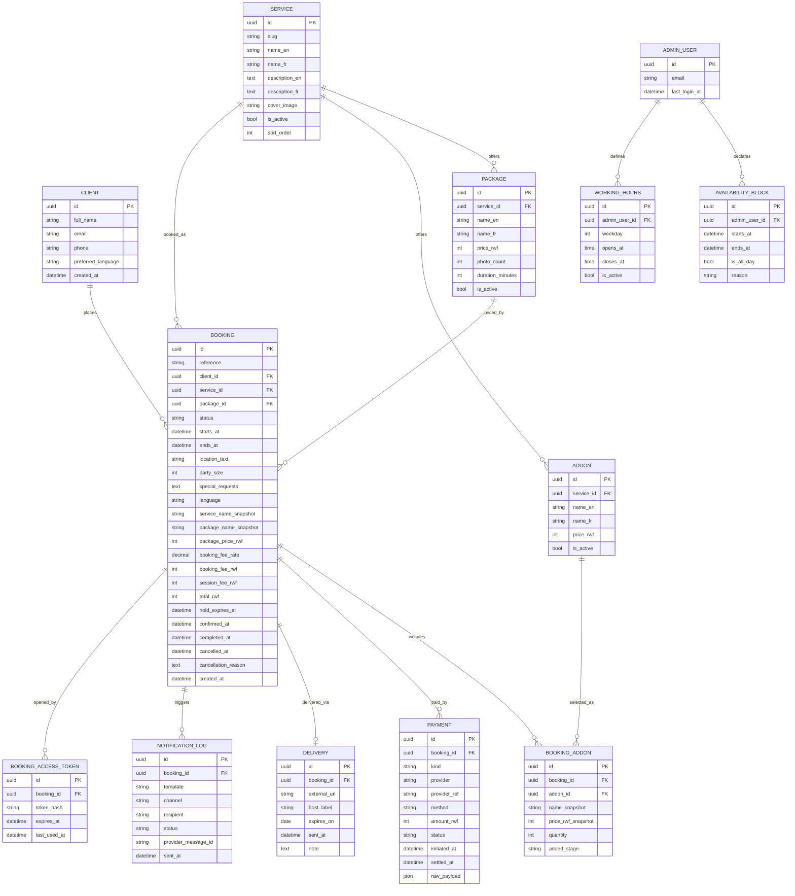

# Bookly — Photographer Booking Platform
## Technical Specification (v1)

| | |
|---|---|
| **Client** | Bookly (single-photographer studio, Kigali, Rwanda) |
| **Source inputs** | `brief.md`, `clien-answers.md` |
| **Status** | Draft for client sign-off — **blocked items listed in §8** |
| **Precedence rule** | Where `brief.md` and `clien-answers.md` disagree, the Q&A wins (it is newer). Every conflict found is logged in §8.2. |
| **Currency / timezone / locales** | RWF only · Africa/Kigali (UTC+2, no DST) · English + French |

---

## 1. Overview

Bookly is a public booking website plus a private admin panel for a professional photographer in Kigali who currently takes bookings over WhatsApp against a personal calendar. Its users are two: prospective clients booking photoshoots, event coverage, and product photography, and the photographer himself as the sole administrator. The system exists to end double bookings by making one database the single source of truth for availability, to let clients self-serve from browsing a service through to paying a non-refundable 40% booking fee that locks the date, and to carry the job through to its end — session-fee collection after the shoot and a branded photo-delivery email. The site is bilingual (English/French), prices in RWF, and accepts Mobile Money (MTN MoMo, Airtel Money) and cards.

---

## 2. Users & Roles

### 2.1 Roles

| Role | Identification | Can see | Can do |
|---|---|---|---|
| **Visitor** | None (anonymous) | Service list, service detail, packages and prices, available dates and time slots, static pages, privacy notice | Browse services, check availability, start a booking, pay a booking fee, switch language (EN/FR) |
| **Booking client** | Per-booking identity — mechanism pending **A-2** | Own booking only: status, date/time, service and package, amounts due and paid, delivery link and its expiry date | Reopen own booking, download delivered photos, request cancellation, pay the session fee |
| **Admin (photographer)** | Authenticated — method pending **A-11** | Everything: full calendar, all bookings, all client contact details, all payments, all deliveries, notification log, settings | Manage availability and blocks, cancel/reschedule/complete bookings, mark no-shows, create and edit services, packages and add-ons in both languages, adjust prices and the booking-fee rate, record payments, send session-fee requests, attach delivery links, resend emails |

**Constraints on roles in v1:** exactly one admin account. There is no staff/second-photographer role, no permission tiers, and no client-to-client visibility. Clients never see other bookings, other clients, or blocked-date reasons — a blocked slot is rendered simply as unavailable.

### 2.2 Permission matrix

**✓** = permitted · **●** = own records only · **—** = denied

| # | Capability | Visitor | Booking client | Admin |
|---|---|:---:|:---:|:---:|
| | **Public site** | | | |
| P-01 | Browse services, packages, add-ons, prices | ✓ | ✓ | ✓ |
| P-02 | View the availability calendar (free slots only) | ✓ | ✓ | ✓ |
| P-03 | See why a slot is blocked (block reason) | — | — | ✓ |
| P-04 | Switch site language (EN/FR) | ✓ | ✓ | ✓ |
| | **Booking** | | | |
| P-05 | Create a booking and place a 30-minute slot hold | ✓ | ✓ | — 1 |
| P-06 | Pay the booking fee | ✓ | ✓ | — |
| P-07 | View a booking's details, status, and amounts | — | ● 2 | ✓ |
| P-08 | Pay the session fee | — | ● | — |
| P-09 | Cancel a booking | — | ● | ✓ |
| P-10 | Reschedule a booking to a new slot | — | — 3 | ✓ |
| P-11 | Mark a booking `completed` or `no_show` | — | — | ✓ |
| P-12 | Open the delivery link and download photos | — | ● | ✓ |
| | **Client data** | | | |
| P-13 | View client name, email, phone | — | ● | ✓ |
| P-14 | Request erasure of own personal data (§7) | — | ● | ✓ |
| | **Availability** | | | |
| P-15 | Set recurring weekly working hours | — | — | ✓ |
| P-16 | Create, edit, or delete availability blocks | — | — | ✓ |
| | **Catalogue & pricing** | | | |
| P-17 | Create or edit services, packages, add-ons (EN + FR) | — | — | ✓ |
| P-18 | Activate or deactivate a service or package | — | — | ✓ |
| P-19 | Change prices | — | — | ✓ |
| P-20 | Add post-shoot add-ons to a booking | — | — | ✓ |
| | **Money** | | | |
| P-21 | View payment records and status | — | ● | ✓ |
| P-22 | Record a refund as issued | — | — | ✓ |
| P-23 | Change the booking-fee rate | — | — | ✓ |
| | **Delivery** | | | |
| P-24 | Attach or update a delivery link and its expiry date | — | — | ✓ |
| P-25 | Send or resend the delivery email | — | — | ✓ |
| | **System** | | | |
| P-26 | Reach any `/admin` route | — | — | ✓ |
| P-27 | View the notification log | — | — | ✓ |
| P-28 | Resend any transactional email | — | — | ✓ |
| P-29 | Edit settings (fee rate, lead time, hold duration, expiry default) | — | — | ✓ |

1 Bookings taken offline (phone, WhatsApp, walk-in) are entered by the admin as an availability block (§3.3), not as a booking record. There is no admin-side "book on behalf of a client" screen in v1 — see **A-16**.
2 "Own" resolves to a single booking under A-2 Option C, or to every booking belonging to the account under Option B. **Pending A-2.**
3 A client who needs a different date cancels (forfeiting the booking fee, §6.8) and books again, or contacts the photographer, who reschedules on their behalf.

**Enforcement.** Every permission above is checked server-side on the route and API handler; no permission is enforced by hiding UI alone. The booking client's scope is derived from the credential in their return link or session (**A-2**) and is never taken from a booking id or email address supplied in the request. Admin routes are gated by the admin session (**A-11**). Two rules bind all roles including the admin: rows referenced by a booking cannot be hard-deleted (§5.3 rule 6), and `payment` and `notification_log` rows cannot be edited or deleted at all — they are the audit trail.

---

## 3. User Flows

### 3.1 Booking a shoot (primary flow)

1. Visitor lands on the site and picks a language (EN or FR); the choice persists for the session and is stored on any booking created.
2. Visitor browses the service list and opens a service (e.g. *Personal photoshoot*, *Corporate*).
3. Visitor selects a package (price, photo count, session duration) and any add-ons offered for that service. The running total in RWF updates as selections change.
4. Visitor opens the calendar. The system renders only slots that satisfy all of: inside the admin's working hours, not covered by an availability block, not overlapping a `confirmed` or unexpired `pending_payment` booking, and starting later than the minimum lead time (default 2 hours; see **A-10**).
5. Visitor picks a date and start time. The slot length equals the selected package's duration.
6. Visitor fills the booking form: full name, email, phone, shoot location, number of people, and special requests (field set pending **A-13**).
7. The system shows a summary: service, package, add-ons, total price, **booking fee = 40% of total** (rate is admin-configurable), and the remaining session fee due after the shoot. It states plainly that the booking fee is **non-refundable**.
8. Visitor confirms. The system creates the booking as `pending_payment` and places a hold on the slot for **30 minutes**.
9. Visitor is redirected to the payment provider's hosted checkout and pays the booking fee by MTN MoMo, Airtel Money, or card (provider pending **A-3**).
10. On a successful payment webhook, the system moves the booking to `confirmed`, records the payment, and permanently removes the slot from public availability.
11. The system sends: a confirmation email to the client (in the booking's language) containing the booking reference, date/time, location, amounts paid and outstanding, and their return link; and a "new booking" alert email to the admin.
12. The booking appears on the admin calendar automatically. No admin approval step is required — see contradiction **C-1**.

### 3.2 Payment abandoned or failed

1. Visitor reaches the hosted checkout and abandons it, or the payment fails.
2. The hold expires 30 minutes after the booking was created. A scheduled job moves the booking to `expired` and returns the slot to public availability.
3. No email is sent to the client for an expired hold. No admin alert is sent. The record is retained for reporting.
4. A late "succeeded" webhook for an already-expired booking is handled per **§6.7**.

### 3.3 Admin manages availability

1. Admin signs in and opens the calendar (month, week, and day views).
2. Admin sets recurring weekly working hours (per weekday, one open/close window).
3. Admin blocks time as unavailable, choosing either a **full day** (or a range of days) or a **specific time range within a day**, with an optional private reason.
4. Blocked and booked time disappears from the public calendar immediately on save.
5. If a new block overlaps an existing confirmed booking, the system warns and requires explicit confirmation — see **§6.4**.

### 3.4 Admin manages services and pricing

1. Admin opens Services and creates a service with a name and description **in both English and French**, plus a cover image and display order.
2. Admin adds packages to that service, each with a price in RWF, a photo count, and a session duration.
3. Admin adds optional add-ons (price in RWF), available for selection at booking time or added by the admin after the shoot.
4. Admin edits prices at any time. Existing bookings keep the prices captured when they were made — see **§6.9**.
5. Admin deactivates a service or package instead of deleting it — see **§6.10**.

### 3.5 Post-shoot: session fee and photo delivery

1. After the shoot date passes, the admin opens the booking and marks the shoot `completed`.
2. Admin adds any post-shoot add-ons (extra photos, extra prints). The outstanding session fee recalculates.
3. Admin triggers "Request session fee". The system emails the client a branded request with the amount due and a payment link.
4. Client pays by MoMo or card. The webhook records the session-fee payment and marks the booking fully paid. The admin receives a payment-received alert.
5. Admin pastes the delivery link for the shoot into the booking, together with the link's expiry date (delivery mechanism pending **A-7**, retention pending **A-8**).
6. Admin triggers "Send photos". The system sends a branded delivery email in the client's language, containing the link and the stated expiry date, and logs the send.
7. Client opens the link and downloads the photos.

### 3.6 Cancellation

**Client-initiated:** client opens their booking, requests cancellation, and confirms an on-screen notice that the booking fee is not refunded. The booking moves to `cancelled_by_client`, the slot returns to public availability immediately, and both parties receive a cancellation email.

**Admin-initiated:** admin opens the booking, cancels or reschedules it with a reason. On cancel, the booking moves to `cancelled_by_admin` and the slot is released. On reschedule, the admin selects a new slot; the booking keeps its reference, payments, and amounts, and the old slot is released. Both actions email the client. **The refund/compensation policy attached to these actions is undecided — see A-5.** The system records the action and any refund the admin marks as issued; it does not move money back automatically in v1.

### 3.7 Returning client access

Client opens the link in their confirmation email and sees their booking status, amounts, and (once delivered) the photo link. The exact mechanism — account login versus a per-booking secure link — is **pending A-2** and determines whether a client sees one booking or all of their bookings.

---

## 4. Scope

### 4.1 In scope (v1)

- Bilingual (EN/FR) public site: service list, service detail with packages and add-ons, availability calendar, booking form, payment, confirmation page.
- Availability engine: admin weekly working hours, full-day blocks, partial-day (time-range) blocks, minimum lead time, and conflict prevention enforced at the database level.
- Booking lifecycle: `pending_payment` → `confirmed` → `completed`, plus `cancelled_by_client`, `cancelled_by_admin`, `no_show`, `expired`.
- Payments: booking fee (40% of total, admin-configurable rate) taken online at booking time; session fee requested and taken online after the shoot. MTN MoMo, Airtel Money, and card, through one gateway.
- Non-refundable booking fee on client cancellation, stated to the client before payment.
- Add-ons: selectable at booking and addable by the admin after the shoot, recalculating the session fee.
- Admin panel: authentication, calendar (month/week/day), booking list with filters and detail view, block management, service/package/add-on CMS in both languages, settings (booking-fee rate, minimum lead time, hold duration, delivery expiry default).
- Post-shoot workflow: mark complete, request session fee, record payment, attach delivery link with expiry, send branded delivery email, resend any email.
- Transactional email in the client's language: booking confirmation, new-booking admin alert, session-fee request, payment receipt, photo delivery, cancellation. All sends logged.
- Prices in RWF only; all times displayed in Africa/Kigali.
- Privacy notice page and consent checkbox at booking.

### 4.2 Out of scope (v1) — explicitly excluded to protect the delivery date

- **Multiple photographers, staff accounts, or role permissions.** One admin account only.
- **SMS notifications.** The Q&A calls SMS and WhatsApp "ideal"; both are deferred — see **C-3** and **A-12**.
- **WhatsApp notifications / WhatsApp Business API.** Requires Meta business verification, template approval, and a paid provider.
- **Built-in photo hosting, upload, galleries, or proofing.** Files are hosted externally in v1 (pending **A-7**); the site stores a link, not the photos.
- **Two-way Google Calendar sync.** Direction and depth of any sync is pending **A-9**; two-way conflict resolution is excluded from v1 regardless.
- **Automated refunds.** Refunds, where a policy eventually requires one, are issued by the photographer outside the system and recorded manually.
- **Kinyarwanda** or any language beyond English and French.
- **Client reviews, testimonials, portfolio galleries, or a blog** beyond the images attached to service listings.
- **Discount codes, vouchers, gift cards, seasonal promotions, or per-client pricing.** Prices are per package, editable by the admin, and identical for all clients.
- **Recurring or multi-day bookings**, group/multi-slot bookings, and waiting lists.
- **Invoicing, accounting exports, tax documents, or a revenue dashboard** beyond a bookings and payments list.
- **Native mobile apps.** The site is mobile-first and responsive.
- **Contracts, model releases, or e-signature.**

---

## 5. Data Model

A dedicated `data-model.md` will expand this. What follows is the authoritative entity set, the fields that carry business rules, and the relationships.

### 5.1 Entities

| Entity | Purpose | Notable fields |
|---|---|---|
| `client` | A person who has booked at least once. Deduplicated on lowercased email. | `full_name`, `email`, `phone`, `preferred_language` |
| `service` | A bookable offering, admin-managed. | `name_en`, `name_fr`, `description_en`, `description_fr`, `cover_image`, `is_active`, `sort_order` |
| `package` | A priced tier of a service: price, photo count, duration. | `service_id`, `name_en/fr`, `price_rwf`, `photo_count`, `duration_minutes`, `is_active` |
| `addon` | Optional priced extra, attachable at booking or after the shoot. | `service_id` (null = available on all services), `name_en/fr`, `price_rwf`, `is_active` |
| `booking` | One reserved slot and its commercial state. Holds **price snapshots**, not live prices. | `reference`, `status`, `starts_at`, `ends_at` (both UTC), `location_text`, `party_size`, `special_requests`, `language`, `service_name_snapshot`, `package_name_snapshot`, `package_price_rwf`, `booking_fee_rate`, `booking_fee_rwf`, `session_fee_rwf`, `total_rwf`, `hold_expires_at`, `confirmed_at`, `completed_at`, `cancelled_at`, `cancellation_reason` |
| `booking_addon` | Add-ons attached to a booking, with their price at the time of attachment. | `booking_id`, `addon_id`, `name_snapshot`, `price_rwf_snapshot`, `quantity`, `added_stage` (`at_booking` \| `post_shoot`) |
| `payment` | One attempt to collect money against a booking. | `booking_id`, `kind` (`booking_fee` \| `session_fee`), `provider`, `provider_ref` (unique), `method` (`momo_mtn` \| `momo_airtel` \| `card`), `amount_rwf`, `status`, `initiated_at`, `settled_at`, `raw_payload` |
| `availability_block` | Admin-declared unavailable time. | `starts_at`, `ends_at`, `is_all_day`, `reason` (private) |
| `working_hours` | Recurring weekly bookable window. | `weekday` (0–6), `opens_at`, `closes_at`, `is_active` |
| `delivery` | The photo handoff for a completed booking. | `booking_id` (unique), `external_url`, `host_label`, `expires_on`, `sent_at`, `note` |
| `notification_log` | Every message the system sent, for audit and resend. | `booking_id`, `template`, `channel`, `recipient`, `status`, `provider_message_id`, `sent_at` |
| `booking_access_token` | Client's return path to a booking. Stored hashed. **Shape depends on A-2.** | `booking_id`, `token_hash`, `expires_at`, `last_used_at` |
| `admin_user` | The photographer's login. **Credential fields depend on A-11.** | `email`, `last_login_at` |
| `setting` | Admin-editable operational values. | `booking_fee_rate` (0.40), `min_lead_time_minutes` (120), `hold_minutes` (30), `delivery_expiry_days` |

### 5.2 ER diagram

### 5.3 Rules the schema must enforce

1. **No overlapping occupancy.** A database-level exclusion constraint over `[starts_at, ends_at)` rejects any second `confirmed` or live `pending_payment` booking on overlapping time. Application-level checks alone are not sufficient — see **§6.1**.
2. **Money is stored as whole RWF integers.** RWF has no minor unit. No floating-point money.
3. **All timestamps are stored in UTC** and rendered in Africa/Kigali.
4. **Snapshots are immutable.** `booking` and `booking_addon` copy names and prices at write time. Editing a `service`, `package`, or `addon` never alters an existing booking.
5. **`payment.provider_ref` is unique**, making webhook processing idempotent.
6. **Soft deletion only** for `service`, `package`, and `addon` via `is_active`. Rows referenced by a booking are never hard-deleted.
7. **Fee arithmetic:** `total_rwf` = package price + add-ons selected at booking. `booking_fee_rwf` = round(`total_rwf` × `booking_fee_rate`). `session_fee_rwf` = `total_rwf` − `booking_fee_rwf` + post-shoot add-ons.
8. **Contingent entities.** `BOOKING_ACCESS_TOKEN` assumes the recommended answer to **A-2**, and `PACKAGE`/`ADDON` assume the recommended answer to **A-1**. Both change shape if the client chooses differently. This is the most expensive part of the spec to revise after build starts.

---

## 6. Edge Cases

| # | Edge case | Decided behavior |
|---|---|---|
| 6.1 | **Double booking (race condition)** | Two clients paying for the same slot simultaneously cannot both succeed. The slot is claimed inside a database transaction protected by an exclusion constraint on overlapping time ranges; the loser's transaction fails, their payment is not captured (or is flagged for refund if already captured), and they see "this slot was just taken" with the calendar refreshed. UI-level availability checks are treated as advisory only. |
| 6.2 | **Abandoned or failed payment** | A `pending_payment` booking holds its slot for 30 minutes (`hold_minutes`). A scheduled job then expires the booking and releases the slot. No client or admin email is sent. The client may start a fresh booking at any time. |
| 6.3 | **Blocked dates (full-day and partial-day)** | The admin blocks either whole days/date ranges or a time range inside a day. Blocked time is subtracted from working hours before slots are generated, so it never appears in the public calendar. Block reasons are private to the admin. |
| 6.4 | **Block overlapping an existing confirmed booking** | The system does not silently cancel a paid booking. Saving such a block raises a warning naming the affected bookings; the admin must either cancel/reschedule them explicitly (§3.6) or save the block anyway, in which case the confirmed booking stands and remains visible on the calendar as a conflict. |
| 6.5 | **Timezone (Africa/Kigali)** | All instants are stored in UTC and rendered in `Africa/Kigali` (UTC+2, no DST) for every user regardless of device timezone. Every displayed time is labelled. Emails render times in Africa/Kigali. Date-only fields (e.g. delivery expiry) are evaluated at end of day Kigali time. |
| 6.6 | **Minimum lead time / same-day booking** | Slots starting sooner than `min_lead_time_minutes` from now (default 120) are not offered, and are rejected server-side if submitted. Same-day booking is permitted whenever the slot clears that threshold and falls inside working hours. Confirmation of the 2-hour default sits in **A-10**. |
| 6.7 | **Duplicate, out-of-order, or late payment webhook** | Webhook handling is idempotent on `payment.provider_ref` and signature-verified. A repeated webhook is a no-op. A "succeeded" webhook arriving after the hold expired reinstates the booking to `confirmed` **only if** the slot is still free; otherwise the payment is recorded as `succeeded` against an `expired` booking, flagged to the admin for refund, and the admin is emailed immediately. |
| 6.8 | **Client cancellation** | Available at any time before the shoot. The booking fee is **not refunded** — this is displayed before payment and repeated in the cancellation confirmation. The slot returns to public availability immediately. Both parties are emailed. Any session fee already paid is flagged to the admin for manual refund. |
| 6.9 | **Price or package changed after a booking exists** | Bookings are unaffected. Amounts owed and shown are read from the booking's snapshot columns, never from the live `package`/`addon` rows. Admin edits to prices apply to new bookings only. |
| 6.10 | **Service or package deactivated with live bookings** | Deactivation removes it from the public site but keeps every existing booking intact and readable, with its snapshotted name and price. Hard deletion of a referenced service, package, or add-on is blocked. |
| 6.11 | **Post-shoot add-ons change the amount due** | The session fee is recalculated from the current add-on set each time the admin edits it, and is locked once a `session_fee` payment reaches `succeeded`. Adding an add-on after full payment creates a second, separate `session_fee` payment request rather than editing the settled one. |
| 6.12 | **Client no-show** | Mechanism: the admin marks the booking `no_show`; the slot is not returned to availability (the time was consumed) and the booking closes. **The commercial consequence — whether the session fee is still owed, and whether the booking fee alone settles it — is undecided; see A-6.** |
| 6.13 | **Photographer cancels or reschedules** | Mechanism: the admin cancels or reschedules with a reason, the client is emailed, and the slot is released or moved (§3.6). **The compensation policy is undecided; see A-5.** |
| 6.14 | **Delivery link expired or email lost** | The delivery email states the expiry date explicitly. After expiry, the client's booking page shows "this link has expired — contact the photographer" rather than a dead link. The admin can update the link and resend the delivery email at any time from the booking. |
| 6.15 | **Spam or duplicate booking attempts** | The booking endpoint is rate-limited per IP and per email address, and a single email address may hold at most 3 live `pending_payment` bookings. Unpaid holds never block a slot for longer than `hold_minutes`. |

---

## 7. Non-Functional Requirements

**Performance.** The public site is mobile-first and built for Rwandan mobile networks: Largest Contentful Paint under 2.5 s on a 4G connection for service and calendar pages; initial payload under 500 KB excluding images; service images served responsively in WebP/AVIF. A month of availability resolves in under 500 ms at the 95th percentile, backed by an index on `starts_at`.

**Availability.** Target 99.5% monthly uptime on managed hosting. Daily automated database backups with 7-day retention and a documented restore procedure. No 24/7 on-call commitment in v1.

**Security.** HTTPS everywhere with HSTS. No card number, CVV, or Mobile Money PIN ever reaches the application — payment completes on the provider's hosted checkout, keeping the project in PCI DSS SAQ-A scope. Webhook endpoints verify provider signatures and reject unsigned or replayed calls. Admin session cookies are `HttpOnly`, `Secure`, `SameSite=Lax`, with server-side authorization enforced on every `/admin` route and API handler. Client return tokens are stored hashed, are single-purpose, and grant access to one booking only. Secrets live in environment variables, never in the repository. Rate limiting on booking creation, payment initiation, and admin login. Dependencies patched for known critical CVEs before launch.

**Privacy and compliance.** Personal data collected is limited to name, email, phone, shoot location, party size, and special requests. Rwanda's Law N° 058/2021 on the protection of personal data and privacy applies: a privacy notice page, an explicit consent checkbox at booking, a stated retention period, and deletion on request are in scope for the build. Registration of the data controller with the National Cyber Security Authority is the client's own obligation, and is named here so it is not missed. Photo retention is governed by **A-8**.

**Internationalization.** Every public-facing string, email template, date, and currency format exists in English and French. The visitor's language selection is stored on the booking, and every subsequent email for that booking uses it. Prices display in RWF only, with no currency conversion.

**Accessibility and compatibility.** WCAG 2.1 AA contrast and full keyboard operability through the booking flow, including the date picker. Supported: current and previous major versions of Chrome, Safari, Firefox, and Edge, with Android Chrome as the priority target.

**Observability.** Application errors and failed payment webhooks are captured by an error-tracking service, and failures on payment or email delivery raise an email alert to the admin. Every outbound message is written to `notification_log` and visible in the admin panel.

**Implementation stack.** Next.js + Tailwind on managed hosting, with a managed PostgreSQL database (chosen for the range-exclusion constraint that §6.1 depends on). The client stated no technology constraint; this is the delivery team's standard stack, recorded here for estimation rather than imposed by the client.

---

## 8. Ambiguity Log

Every item below blocks or reshapes a specific part of the build. Each carries concrete options, a recommendation, and the one fact that would change that recommendation.

### 8.1 Open decisions

| ID | Area | Severity | Question | Blocks |
|---|---|---|---|---|
| A-1 | Pricing | **Blocker** | How is a service priced? | Data model, booking UI |
| A-2 | Client identity | **Blocker** | Accounts, guest, or per-booking link? | Data model, auth, delivery |
| A-3 | Payments | **Blocker** | Which payment gateway? | All payment work |
| A-4 | Payments | High | Is 40% fixed, and who absorbs gateway fees? | Fee calculation |
| A-5 | Policy | High | What happens when the photographer cancels or reschedules? | §6.13, emails |
| A-6 | Policy | High | What happens on a client no-show? | §6.12 |
| A-7 | Delivery | **Blocker** | Where do delivered photos live? | Delivery module |
| A-8 | Delivery | High | How long do links and files stay available? | Delivery, privacy notice |
| A-9 | Calendar | High | Does the site sync with Google Calendar, and in which direction? | Calendar module |
| A-10 | Availability | **Blocker** | Working hours, slot granularity, buffer, lead time | Availability engine |
| A-11 | Admin auth | High | How does the photographer log in? | Admin module |
| A-12 | Notifications | Medium | SMS and WhatsApp — in or out? | Scope, budget |
| A-13 | Booking form | Medium | Fixed field set or admin-defined fields? | Booking form, data model |
| A-14 | Content | Medium | Who writes the French copy? | CMS, launch content |
| A-15 | Delivery plan | High | No launch date or budget has been stated | Scope negotiation |
| A-16 | Admin booking entry | Medium | Can the admin enter an offline booking as a real booking? | Permission matrix, admin UI |

---

**A-1 — Pricing model.** *The Q&A referred this question back to an earlier answer, which did not select an option.*
- **Option A — Formula/variable pricing.** A base price plus rates per extra hour and per extra block of photos; the client dials in an exact configuration.
- **Option B — Packages + add-ons.** Each service carries 2–3 fixed packages (price, photo count, duration) that the admin edits in the CMS, plus optional priced add-ons.
- **Option C — One flat price per service**, with all variation handled by creating more services.
- **Recommendation: B.** It matches the stated need for dynamic, admin-editable pricing without building a pricing engine, and it is what the session-fee answer ("fixed, but can have add-ons") already describes. §5 is drawn on this basis. **What would change it:** if the photographer quotes most jobs by negotiating hours and photo counts individually rather than selling named packages, choose A and accept the extra build time.

**A-2 — Client identity: account, guest, or magic link.** *The Q&A answered "yes" to an either/or question, so the intent is not determinable.*
- **Option A — Guest booking only.** Name, email, phone per booking. Nothing to return to except the emails already sent.
- **Option B — Full accounts.** Email and password, booking history, re-download at any time. Adds signup friction and credential-security obligations.
- **Option C — Guest booking + a secure per-booking link.** No password; the confirmation email contains a unique long-lived link that reopens the booking to check status and download photos.
- **Recommendation: C.** It removes the main weakness of guest booking without taking on password storage, reset flows, and account management, and it fits a single-photographer business whose clients book occasionally. **What would change it:** if the photographer expects a core of repeat corporate clients who want one dashboard covering all their shoots, choose B.

**A-3 — Payment gateway.** Both MoMo (MTN and Airtel) and cards are required. Note as a hard constraint: Stripe does not onboard Rwandan merchants, so it is not a candidate.
- **Option A — Flutterwave.** One integration covering MTN MoMo, Airtel Money, and cards, settling in RWF.
- **Option B — Paypack or IremboPay** (local Rwandan aggregators) for MoMo, with cards added separately or omitted.
- **Option C — Direct MTN MoMo Collections API + Airtel Money API**, cards handled by a separate provider.
- **Recommendation: A.** One integration, one webhook contract, one reconciliation surface, and it satisfies the "cards too" answer without a second vendor. **What would change it:** if the photographer already holds a merchant account, MoMo Pay code, or a negotiated rate with a local aggregator, take Option B and integrate against what exists. The client must confirm which merchant accounts he already holds and in whose name — the gateway cannot be built against an unknown account.

**A-4 — Booking-fee rate and transaction fees.** The Q&A says "40% or can be dynamic. It can change over time."
- **Option A — One global rate** (40%) editable in settings, applied to all new bookings.
- **Option B — Global default with a per-service override** (e.g. 40% on events, 30% on product shoots).
- **Option C — Admin sets the fee manually per booking** before the client pays.
- **Recommendation: B.** It honours "can change over time" while keeping the client's self-serve flow fully automatic; C breaks self-service, because a human must intervene before every payment. **What would change it:** if the rate is uniform and never varies by service, A is less to build. Separately, the client must state whether the gateway's transaction fee (typically 1.5–3.5% in this market) is absorbed by him or added on top of what the client pays — this changes the arithmetic in §5.3 rule 7.

**A-5 — Photographer cancels or reschedules.** *The Q&A answer was "suggest."*
- **Option A — Reschedule first, refund if nothing suits.** The client is offered alternative dates; if none work, the booking fee is refunded in full.
- **Option B — Automatic full refund** of the booking fee whenever the photographer cancels, with rescheduling offered separately.
- **Option C — Credit.** The booking fee is retained as credit against a future booking with no expiry, and is not refunded in cash.
- **Recommendation: A.** It protects his reputation in a referral-driven local market while keeping most cancellations as rescheduled revenue rather than refunds. **What would change it:** if refunding via MoMo is operationally awkward or costly for him, choose C and state the credit terms in the booking terms text.

**A-6 — Client no-show.** *Not covered by the Q&A beyond the shared "suggest."*
- **Option A — Booking fee forfeited, no session fee owed, booking closed.** The photographer keeps 40% for the reserved time.
- **Option B — Forfeited, plus one paid reschedule** at a stated rebooking fee.
- **Option C — One free reschedule** within a stated window, then forfeit.
- **Recommendation: A.** It is the simplest to build and to state in the booking terms, and the non-refundable booking fee already carries this logic. **What would change it:** if the photographer would rather recover the job than the fee, choose C and set the window.

**A-7 — Photo delivery mechanism.** *The Q&A asked for a recommendation; the client mentioned prior use of WeTransfer.*
- **Option A — Built-in storage** (S3 or Cloudinary) with signed expiring links generated by the site.
- **Option B — External link only**, emailed by the photographer himself.
- **Option C — Hybrid.** Files stay on an external host (Drive, Dropbox, WeTransfer); the admin pastes the link into the booking and **the site** sends the branded delivery email and tracks it.
- **Recommendation: C.** It gives a branded, tracked delivery step at effectively no storage or bandwidth cost, matches how he already works, and leaves the door open to A later without reworking the booking model. §3.5 and §5 are written on this basis. **What would change it:** if he wants clients to browse a proofing gallery on his own domain, or wants download tracking and enforced expiry, go to A and budget for storage and egress. **Note:** the follow-up question about bulk images versus a single zip only becomes relevant under Option A — under C, the external host decides that.

**A-8 — Retention and link expiry.** *This question was left unanswered.*
- **Option A — Keep links and files available indefinitely.**
- **Option B — A fixed window after delivery** (60–90 days), with the expiry date shown to the client in the delivery email and on their booking page; the photographer's own drive is the long-term archive.
- **Option C — A short window** (30 days).
- **Recommendation: B at 90 days.** It bounds cost and support load, matches a workflow where edited masters live on his own drive, and 90 days is long enough that "can you resend it" is rare. **What would change it:** if he intends the site to be the archive of record rather than a handoff, choose A and move to A-7 Option A. This answer also sets the personal-data retention statement required by §7.

**A-9 — Google Calendar.** *The Q&A confirmed he uses Google Calendar but did not say what the site should do with it.*
- **Option A — No sync.** The site's calendar is the single source of truth; offline commitments are entered as blocks.
- **Option B — One-way push** (site → Google Calendar), plus a read-only subscription feed. Confirmed bookings appear in his phone calendar automatically; his personal Google events do not affect site availability.
- **Option C — Two-way sync.** Google events block site availability and vice versa. Requires OAuth, webhook channel renewal, and conflict resolution.
- **Recommendation: B.** He gets bookings on the phone calendar he already checks, without the failure modes of two-way sync — and the site stays the single source of truth, which is the entire point of the project. **What would change it:** if he will keep accepting bookings directly into Google Calendar after launch, only C prevents double bookings — and C reintroduces exactly the split source of truth the brief set out to eliminate, so the cheaper fix is his commitment to enter offline commitments as blocks in the site.

**A-10 — Working hours, slot granularity, buffer, lead time.** The Q&A gives a 2-hour lead time inside "working hours" but never defines them.
- **Option A — Fixed weekly hours + slot starts on a 30-minute grid + a configurable buffer between shoots.**
- **Option B — Fixed weekly hours + slot starts on the hour**, no buffer.
- **Option C — The admin publishes specific bookable slots by hand** each week; nothing is generated.
- **Recommendation: A with a 30-minute buffer.** It generates availability automatically (no weekly admin chore) while protecting travel and setup time between shoots. **What would change it:** if shoots are on location across Kigali with unpredictable travel, raise the buffer to 60 minutes. **The client must supply: his working days and hours, the buffer he wants between shoots, and confirmation that 2 hours is the true minimum notice.** Until those three values exist, the availability engine cannot be built.

**A-11 — Admin authentication.** Not addressed in either input.
- **Option A — Email + password** with a rate-limited login and optional TOTP two-factor.
- **Option B — Passwordless magic-link login** to his registered email address only.
- **Option C — Google sign-in** restricted to a single allow-listed address.
- **Recommendation: C.** He already lives in a Google account (per A-9), it removes password storage from the project entirely, and it inherits Google's own two-factor protection. **What would change it:** if he wants the admin panel reachable without a Google session, or objects to Google as an auth dependency, choose A and require two-factor — this panel controls his revenue and his clients' contact details.

**A-12 — SMS and WhatsApp notifications.** The Q&A calls both "ideal"; `brief.md` lists both as out of scope. **See C-3.**
- **Option A — Email only in v1.** Zero per-message cost, no third-party approval process.
- **Option B — Email + SMS** through a local aggregator or Twilio. Adds a per-message cost and a sender-ID registration step.
- **Option C — Email + WhatsApp** via the WhatsApp Business Cloud API. Adds Meta business verification, template approval (typically 1–3 weeks of lead time), and a paid provider.
- **Recommendation: A for v1, with B or C as phase 2.** Both alternatives add recurring cost and, for WhatsApp, an approval process outside the delivery team's control that can hold up launch. **What would change it:** if reaching clients on WhatsApp is a launch requirement rather than a preference, start the Meta verification immediately — it is the long pole, not the code.

**A-13 — Booking form fields.** The Q&A said "anything an order can need" and invited suggestions.
- **Option A — A fixed field set:** name, email, phone, shoot location, number of people, special requests, preferred language, consent checkbox.
- **Option B — Fixed set + per-service custom fields** the admin defines in the CMS (e.g. "event venue" for events, "product count" for product shoots).
- **Recommendation: A for v1.** It covers everything named in the Q&A and keeps the data model rigid enough to query; B turns bookings into a form-builder product and roughly doubles the admin CMS. **What would change it:** if different service types genuinely need different information at booking time, choose B — and decide it now, because retrofitting custom fields onto a shipped booking table is expensive.

**A-14 — French content.** The site is English + French, and services are admin-authored.
- **Option A — The photographer writes both language versions** for every service, package, and add-on in the CMS.
- **Option B — The delivery team translates the launch content once**; he maintains English afterwards, and new content appears in English on the French site until translated.
- **Option C — UI chrome in both languages, service content in English only.**
- **Recommendation: B for launch, A afterwards**, with the CMS requiring both fields so nothing ships half-translated. **What would change it:** if he is comfortable writing French himself, A costs nothing extra. Under any option, the client must supply the launch service list, descriptions, prices, and images — currently the largest missing content dependency.

**A-15 — Timeline and budget.** Neither input states a launch date, a budget, or a hard deadline. Every item in §4.2 was excluded to protect a date that has not been named. **Required from the client: a target launch date and a budget ceiling.** Until both exist, the §4.2 boundary is the delivery team's proposal rather than an agreed constraint, and no estimate drawn from this document can be committed to.

**A-16 — Admin-entered bookings.** Surfaced by the permission matrix (P-05): today he takes bookings on WhatsApp, and the spec's only mechanism for an offline commitment is a blocked slot with no client, no payment record, and no delivery step.
- **Option A — Blocks only.** Offline jobs are blocked time. They never become bookings, and they generate no emails, payments, or photo delivery through the site.
- **Option B — Admin creates a full booking** on a client's behalf, choosing a service and package, with payment recorded manually as cash or MoMo received outside the site. The client then gets the same emails and delivery flow as an online booking.
- **Option C — Admin sends a booking link** to the client, who completes and pays for it themselves through the normal flow.
- **Recommendation: B.** It puts every job in one system — which is the point of the project — and the delivery and session-fee workflows already exist; the only new pieces are an admin booking form and a "payment received offline" record. **What would change it:** if every client will be pushed to the website from day one, A is nothing to build and C covers the stragglers. This decision also determines whether the `payment` table needs an `offline_cash` / `offline_momo` method value.

### 8.2 Contradictions found between `brief.md` and `clien-answers.md`

Resolved in favour of the Q&A (newer), and logged here so the client can correct the resolution if it is wrong.

| ID | `brief.md` says | `clien-answers.md` says | Resolution |
|---|---|---|---|
| C-1 | §4.1 / §4.2: booking requests go to the admin, who confirms or declines each one | Bookings auto-confirm on payment; the admin is notified by email and the calendar updates automatically | **Auto-confirm on successful booking-fee payment.** No pending-approval queue is built, and a `declined` status does not exist. The admin retains cancel and reschedule after the fact (§3.6). |
| C-2 | §6: multi-language support is out of scope | "English and French" | **English + French are in scope**, including all emails and admin-authored service content (see A-14). This is a material addition to the brief's scope. |
| C-3 | §6: SMS and WhatsApp Business API integration is out of scope | "both would be ideal" | **Out of scope for v1** (§4.2), raised as **A-12**. "Ideal" is read as a preference, not a launch requirement; the client can overturn this by answering A-12. |
| C-4 | §4.4: card payments are an open question | "yes" | **Cards are in scope** alongside MTN MoMo and Airtel Money, through one gateway (A-3). |
| C-5 | §3: whether clients need accounts is an open question | "yes" — given in answer to an either/or question | **Unresolved**, escalated to **A-2**. The Q&A does not settle it. |

---

## Sign-off

Approving this document confirms §1–§7 as the agreed build, and accepts that the sixteen items in §8.1 — five of them marked **Blocker** — must be answered before the corresponding modules can be estimated or started.

| | Name | Date |
|---|---|---|
| Client | | |
| Developer | | |
