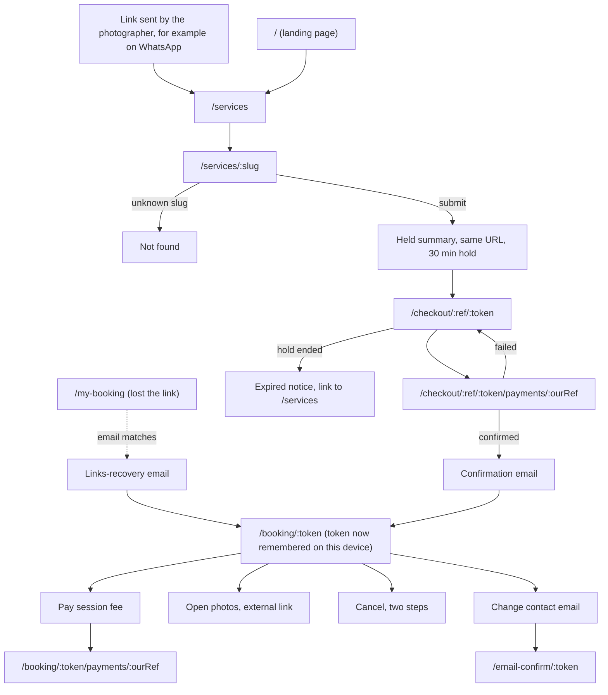
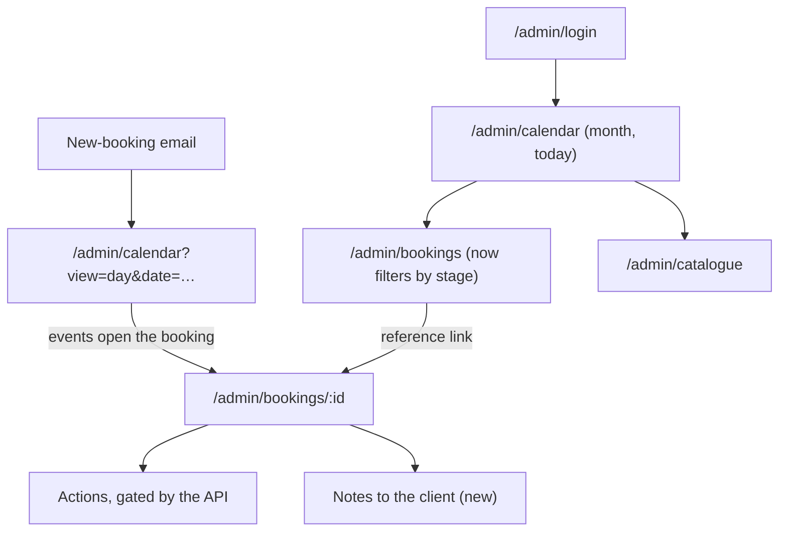
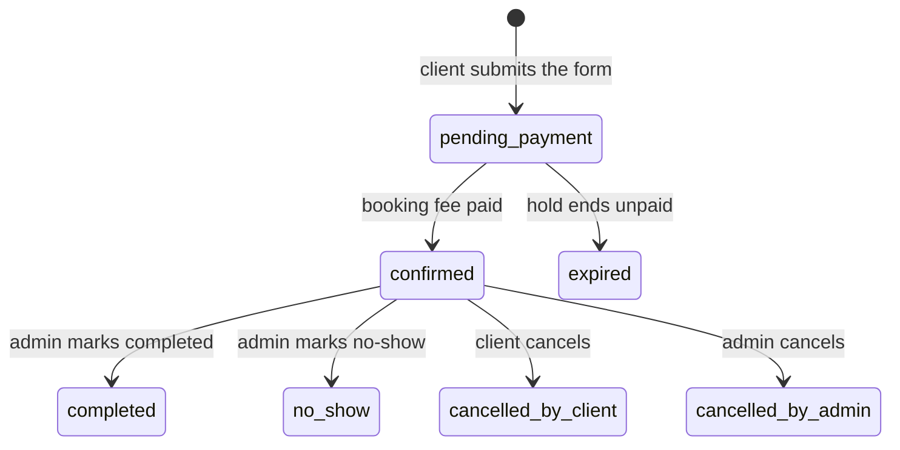

# Bookly user journeys: current and ideal

Written 2026-09-20 from the code at commit `7cf03ea` (branch `redesign/visual-only`, Phase 3 sections 1-2 applied). Sections 1 and 7 were rewritten 2026-09-23, after the visual redesign finished, by walking the app in Chromium with `/api` mocked. **Rewritten again 2026-09-27**, this time from the code at commit `dca8ca6` (`main`), against `docs/prompts/client-access-and-admin-polish.md` (eight items, all merged 2026-09-25: loading skeletons, the red sign-out button, delivery-recipient confirm, self-service "My booking" link recovery, remembering the booking link on-device, client email changes, booking stages with a legend, and client notices plus photographer notes) and `docs/prompts/admin-console-redesign.md` / `DESIGN.md`'s "Admin console" section (the developer-console visual pass, merged 2026-09-26-27). This pass was **read from the code and the prompt files' "as built" notes, not re-walked in a browser** — see section 9.

**Status tags** used below: `[exists]` works today, `[partial]` works with a gap, `[missing]` not built. **Priority:** **Must** before launch, **Should** soon after or when cheap, **Could** worth considering, **Decision** needs an answer first.

---

## 1. Route map (current)

**Updated 2026-09-27 from `frontend/src/routes.tsx`.** Section 1 was walked in a browser on 2026-09-23; the four routes added since (`/my-booking`, `/email-confirm/:token`) and the admin visual pass have not been re-walked, only read.

### Public (no sign-in)

All of these sit inside the pathless layout route `ClientShell`. It puts a static header (the wordmark, "My booking", "Admin login", "Book now") and a footer on every client page, as **siblings** of the page's own `<main>` — there is exactly one `main` per page. A skip link is the first focusable element. Below `sm`, "Admin login" moves out of the header bar into the footer so the bar still fits one row at 320px (2026-09-25 decision).

| Route | Page | What it is |
|---|---|---|
| `/` | Home | Landing page: hero and call to action, a preview of the first three services (skeleton cards while it loads), the four booking steps, four facts the code enforces, a closing call to action. Copy is still the developer's own words — see gap 6. |
| `/services` | ServiceList | Grid of active services with a "From X RWF" line; skeleton cards (same size and grid as `ServiceCard`) while loading. |
| `/services/:slug` | ServiceDetail | The whole booking funnel on one page. On success the same URL shows the "held" summary. An unknown or deactivated slug shows Not found. |
| `/checkout/:reference/:token` | CheckoutPage | Pay the booking fee. States: pay, paid, closed, expired, invalid link. |
| `/checkout/:reference/:token/payments/:ourRef` | PaymentProgressPage | Follows one payment until it settles (polls every 3 s, gives up after 10 min). |
| `/my-booking` | MyBookingPage | **New 2026-09-25.** Type an email, get a "fresh link for every current booking" if there is a match — the page says the same thing (sent or not) regardless, so it never reveals who has a booking. Reached from the header's "My booking" link (when no booking is stored on this device) and from a "Get a new link" link on the invalid-link state of `/booking/:token`. |
| `/email-confirm/:token` | EmailConfirmPage | **New 2026-09-25.** Confirms a client's requested change of contact email — on a button press, not on page load, because mail scanners open links. Shows success or "This confirmation link is not valid". |
| `/booking/:token` | BookingPage | The client's private booking page. Loading it successfully stores the token in `localStorage` (`bookly.bookingToken`); a stored token that 404s is cleared. |
| `/booking/:token/payments/:ourRef` | PaymentProgressPage | Same progress page, used for the session fee. |
| `*` | NotFound | "Page not found" with a link back to services. Inside the shell too. |

### Admin (one photographer)

As of 2026-09-26-27 every `/admin/*` page (including login and reset-password) has been restyled as a developer-console look — see section 1a. Routes and behaviour are unchanged from 2026-09-23; only the look and two new controls (a theme toggle, a breadcrumb) are new.

| Route | Page | What it is |
|---|---|---|
| `/admin/login` | AdminLogin | Email and password, plus a "Forgot your password?" link to the reset page. Outside the shell. |
| `/admin/reset-password` | AdminResetPassword | One route, two jobs: ask for the link, or choose the new password. The token arrives in the URL fragment. Outside the shell. |
| `/admin` | (redirect) | Goes to `/admin/calendar`. |
| `/admin/calendar?view=month\|week\|day&date=YYYY-MM-DD` | AdminCalendar | FullCalendar of bookings, live holds and blocks. Every event opens something — a booking its own page, a block the page that edits it. |
| `/admin/bookings?stage=...&from=...&to=...&search=...` | AdminBookings | Filterable table, 25 per page, sorted by start time, newest first. **Filters by stage now** (see section 1b); old `?status=` links still open, on the stage(s) that status now spans. |
| `/admin/bookings/:id` | AdminBookingDetail | One booking and every action on it, plus (2026-09-25) a "Notes to the client" section. |
| `/admin/catalogue` | AdminCatalogue | Services, packages and add-ons (create, edit, activate, delete). |
| `/admin/availability` | AdminAvailability | Weekly working hours, dated overrides and blocks on one page, with the overlap warning. |
| `/admin/settings` | AdminSettings | The five operating values: booking-fee rate, minimum notice, hold, buffer, delivery days. |

All `/admin/*` pages except login and reset sit inside `AdminLayout`, which redirects to login without a live session (a token in `sessionStorage`, valid 8 hours) and carries its own skip link and nav. The nav is still five links: calendar, bookings, catalogue, availability, settings. A signed-out visitor asking for any admin page still lands on `/admin/login` with **no record of where they wanted to go** — gap 11 is still open. The sign-out button is now styled red (ghost weight, red text and hover tint — 2026-09-25) rather than plain ghost.

#### 1a. Admin visual redesign (2026-09-26-27)

The admin side (only) now looks like a flat, hairline-bordered developer console, in both a light and a dark theme, independent of the client site's own look:

- **Theming:** follows the OS (`prefers-color-scheme`) by default; a System/Light/Dark toggle in the top bar overrides it per device (`localStorage` key `bookly.admin.theme`, applied before first paint). Set via a `data-admin-theme` attribute on `<html>` while an admin page is mounted — a client page never carries it, and client pages were screenshotted pixel-identical before and after this pass.
- **New chrome:** a 56px top bar (mark, breadcrumb reading "Admin › section › booking reference", the theme toggle) over the existing 260px sidebar from `lg`; the same nav reflows to rows below `lg`. No command palette, collapsible sidebar, workspace switcher or other new controls — explicitly out of scope.
- **Type:** Geist / Geist Mono (self-hosted), admin only — the client side keeps Poppins/Open Sans, unchanged.
- **Color:** one violet accent for "where you are" (active nav, links, focus ring, info banners, at most one headline badge); the main action button is an inverted-neutral fill, never violet; green is reserved for success/status.
- **Status badges** now render as one of four shapes (filled check = current, outline check = an earlier success, clock = waiting, cross = failed/cancelled), with dashed/dotted edges telling a hold from a lapsed hold apart in greyscale.
- **On a phone:** checked at 320/375px in both themes — the bookings table stacks into blocks under a container-query breakpoint, form/action button rows go full width, calendar month events shrink to a time and status glyph.

Full spec: `design-system/bookly/admin-console.md`; summary: `DESIGN.md` § Admin console.

#### 1b. Booking stages (2026-09-25)

A display-only **stage**, computed from `status` + the clock + `deliverySentAt` (never a new stored value — `booking.status` and its rules are untouched), now goes out with every client view, admin view and list row, and both the admin bookings table and the client booking page carry a "what do these mean?" popover legend next to the status column/pill:

| Stage | Derived from | Client sees | Admin sees |
|---|---|---|---|
| `awaiting_payment` | `pending_payment` | yes | yes |
| `confirmed` | `confirmed`, before `starts_at` | yes | yes |
| `in_progress` | `confirmed`, between `starts_at` and `ends_at` | yes | yes |
| `needs_review` | `confirmed`, past `ends_at`, not yet marked | shown as `completed` | yes |
| `completed` | `completed`, `deliverySentAt` null | yes | yes |
| `closed` | `completed`, `deliverySentAt` set | yes | yes |
| `no_show` / `expired` / `cancelled_by_client` / `cancelled_by_admin` | as stored | yes | yes |

The client never sees `needs_review` (it reads as `completed`). "Completed" means the shoot is done, whatever is still owed — an outstanding balance is never hidden by the stage label; it shows in the payment section and as a `balance_due` notice (section 1c).

#### 1c. Client notices and photographer notes (2026-09-25)

`GET /api/booking/:token` now returns `notices: { id, kind, at, data }[]`, newest first, rendered at the top of the client booking page's `main`. Built from:
- this booking's client-facing outbox history (reschedule, session-fee request, payment receipt, photo delivery, admin cancellation) — never the raw payload, only an explicit allowlist of fields per kind, so no plaintext access token can leak;
- a derived `balance_due` notice while money is owed and the stage is `completed`/`closed` — this one is **never** hidden by time, only by closing it or paying;
- the photographer's own notes (see below), labelled "From your photographer".

Each notice has an icon, a sentence, a time and a close button. Dismissal and "seen" state are per-device (`localStorage`, keyed by booking reference): a notice a client hasn't closed still stops showing a day after it was first seen — except `balance_due`, which stays until paid or closed.

Admin gets a **"Notes to the client"** section on `/admin/bookings/:id` (new `booking_note` table): add a note (character count, "also email it to the client" ticked by default), see the list with each one's emailed/page-only state, delete with an inline confirm (soft delete — hides it from the client, keeps the row). A note is refused (409) on a booking that was never confirmed.

## 2. Current client journey

Clients are guests: no account. Their identity is the token in the URL, though the header and `localStorage` now soften that a little (section 2.6).

### 2.1 Main path: book a shoot

Unchanged from the 2026-09-20 walk-through — sections 2.1 and 2.2 below still describe that flow accurately; nothing in items 1-8 of the September prompt touched the booking funnel or checkout itself, only what happens after (2.3-2.6) and the loading state (item 1, skeleton cards while `/services` and the home preview load).

| # | Route | What the client sees and does | Notes |
|---|---|---|---|
| 1 | `/services` | Reads the intro and picks a service card. Skeleton cards while loading (new 2026-09-25). | Arrives from a link the photographer sent, or types the address. |
| 2 | `/services/:slug` | Sees the cover image, description, then **1 Choose** a package (radio cards, nothing preselected) and optional add-ons. | Total updates as they choose. |
| 3 | same | **2 Pick a time.** Month calendar of days that have starts, then the times for the chosen day. Choosing a time re-checks it with the API ("Checking…"). | Kigali time, stated. Only free starts appear. |
| 4 | same | **3 Your details:** name, email, phone, location, number of people, special requests, consent tick. | Nothing is saved between visits. |
| 5 | same | The price summary shows total, booking fee (due now, 40% by default), session fee (after the shoot) and a non-refundable notice. **Submit** sits under it. | On phones the summary comes last, after the form. |
| 6 | same URL | Page becomes the **held summary**: reference, service, when, amounts, "held until HH:MM", non-refundable notice, **Pay** button. | The hold is 30 minutes (a setting). No email is sent at this point. |
| 7 | `/checkout/:ref/:token` | Sees reference, service, when, fee, hold time, notice. Picks a method (MTN MoMo is the only one offered), enters the Mobile Money number, presses Pay. | Airtel Money and card are not offered yet. |
| 8 | `…/payments/:ourRef` | Waits. The page says what is happening and never says "confirmed" until the provider's verified callback arrives. | The client approves the payment on their phone. |
| 9 | same | **Confirmed.** A heading and a line of text, plus the booking summary. | Still no link onward from this page — gap 8 is unchanged; the way back is the email or the header's "My booking" link once the client has opened the booking once. |
| 10 | (email) | Confirmation email with reference, when, where, amounts and the **View booking** link. | The admin gets a "new booking" email at the same time. |

### 2.2 Branches on the main path

Unchanged from 2026-09-20/23:

| Where | Trigger | What the client sees | Then |
|---|---|---|---|
| Step 3 | Someone else took the time | "Just taken" alert, calendar refreshed | Picks another time. Details stay typed. |
| Step 5 | Server refuses a field | Field marked and focused | Fixes it. |
| Step 5 | Package or add-on changed under them | "Catalogue changed" message | Reviews the choice. |
| Step 7 | Hold ended | Expired notice with a link to `/services` | Starts again from scratch. |
| Step 7 | Booking already paid, or closed by the photographer | "Paid" or "This booking cannot be paid online. Please contact the photographer." | Still no contact detail shown — gap 4. |
| Step 7 | A payment is already in progress | Banner with a link to follow it | Follows it. |
| Step 8 | Payment declined or provider down | "Failed" with **Try again** | Back to the pay page. |
| Step 8 | Paid, but the slot was taken or the hold had ended | "Received" or "refund" text, amount stated | Waits for the photographer's refund. |
| Step 8 | Still unresolved after 10 min | "Still waiting" and **Check again** | Re-polls. Or closes the tab and waits for the email. |
| Any link | Wrong, expired or replaced token | "This link is not valid" | **Changed 2026-09-25:** a "Get a new link" link now points to `/my-booking` (was a dead end). |

### 2.3 Returning: `/booking/:token`

| Need | What is there | Notes |
|---|---|---|
| See what was booked | Stage badge (see 1b), details card, amounts card (total, paid, outstanding, refund due). | Stage now uses one of four distinguishable shapes, not a plain text pill, with a legend popover next to it. |
| **See what's happened / owed (new)** | A **notices list** at the top of `main`: reschedule, session-fee request, payment received, photos sent, admin cancellation, an unpaid-balance notice, and any note the photographer wrote. Dismissible; balance notices persist until paid or closed. | See section 1c. |
| Pay the session fee | Appears when the photographer has requested it: amount, method, phone, Pay, then the progress page. | Reached from the "session fee request" email button, or the notices list. |
| Get the photos | "Open your photos" (external link, opens in a new tab) with the expiry date. After expiry: "Contact the photographer for a new one." | Still no contact detail shown — gap 4 unchanged. |
| Cancel | Two steps: a warning that the booking fee is not refunded, then confirm. Cancelled state shows the reason and any refund owed. | Only while the API says the booking can be cancelled. |
| **Change the contact email (new)** | A "Contact email" line with a masked address (`a•••••@example.com` — never shown in full) and a "Change" action. Submitting shows "Check &lt;new email&gt; to confirm the change; until then we keep writing to &lt;old email&gt;." Confirming (`/email-confirm/:token`, a button press) swaps it and emails the old address. | New 2026-09-25. The booking's access link itself is not rotated; `client.email` is untouched, only this booking's contact email. |
| Change the date | Still nothing in-product. | The spec sends the client to the photographer; still no contact detail anywhere — gap 4 unchanged. |

### 2.4 Emails the client receives

| Email | Trigger | Link goes to |
|---|---|---|
| Booking confirmation | Booking fee confirmed | `/booking/:token` |
| Payment receipt | A payment is recorded | `/booking/:token` |
| Session-fee request | Admin presses "Request session fee" (pressing it again works as a reminder) | Pay button to `/booking/:token` |
| Photo delivery | Admin presses "Send" on the delivery form (now with a recipient-confirm step, see section 3.3) | The external host (WeTransfer, Drive…) |
| Reschedule | Admin moves the booking | `/booking/:token` |
| Cancellation | Client or admin cancels | n/a |
| Access-link resend | Admin resends the link (the old link stops working) | New `/booking/:token` |
| **Booking links (new)** | Client submits `/my-booking` and has a matching current booking | One email, a fresh link per current booking; old links are replaced |
| **Email-change confirmation (new)** | Client requests a contact-email change | `/email-confirm/:token`, to the **new** address |
| **Email-changed notice (new)** | The change is confirmed | To the **old** address, no link |
| **Client note (new)** | Photographer adds a note with "also email it" ticked | No link — no token plaintext exists to link with |

Still no reminder before the shoot, no add-to-calendar file, and no SMS or WhatsApp — gap 16 unchanged.

### 2.5 Where the current client journey breaks or drags

Re-checked 2026-09-27 against the code, not re-walked in a browser:

1. **Landing copy is still the developer's own words**, not the photographer's — gap 6's decision half is open.
2. **No way to contact the photographer.** Still true: no contact detail anywhere in the product (checkout-closed, delivery-expired, cancel-not-cancellable messages, or the notices). Changing the date is still blocked on this — gap 4.
3. ~~After the booking fee is paid, the page has no "view my booking" link.~~ **Unchanged still on the payment-confirmed page itself** (gap 8), but the client is no longer fully dependent on that one email: the header's "My booking" link remembers the token on this device once the booking page has been opened once, and `/my-booking` gives a self-service way back if the email is lost. This substantially closes the *practical* version of the gap even though the payment-progress page's own "Confirmed" view still has no link onward.
4. **Phones: the total is last.** Unchanged.
5. **Nothing survives a lost hold.** Unchanged: an expired hold means re-choosing the package and re-typing every field.
6. **Only MTN MoMo.** Unchanged.
7. **Consent links nowhere.** Unchanged; `/privacy` is still not a route.
8. **No reminder** before the shoot. Unchanged.
9. **No privacy page** — `/privacy` still resolves to Not found.

### 2.6 New since 2026-09-23: link recovery on this device

- Opening `/booking/:token` successfully stores that token under `localStorage` key `bookly.bookingToken` (wrapped in try/catch; storage that throws or is blocked breaks nothing). A stored token that 404s is removed.
- The header's "My booking" link goes to the remembered booking when one is stored, otherwise to `/my-booking`.
- `/my-booking` and the invalid-link page's "Get a new link" both close what was gap 19 (self-service lost-link resend was previously impossible — no public endpoint existed). It is rate-limited per address (10 min / 24 h windows, computed from the outbox) and per IP (20/hour, in-memory), and always answers the same regardless of outcome so it reveals nothing about who has a booking.

---

## 3. Current admin journey

One admin. Only the photographer signs in. Routes and gating are unchanged from 2026-09-23; the look (section 1a), the bookings filter (now by stage, section 1b), the sign-out button colour, the delivery send flow, and a new notes section are what changed.

### 3.1 Sign in

Unchanged from 2026-09-23: email/password, generic failure message for wrong credentials/unknown email/lockout, always lands on `/admin/calendar` for today, `sessionStorage` session (8 hours or any 401), login never returns to where you were (gap 11 still open), "Forgot your password?" and `/admin/reset-password` both work.

### 3.2 Daily loop: a booking arrives

Unchanged in structure from 2026-09-23 (email → calendar day → click the event → booking detail, two hops). The one change: Bookings' status filter is now a **stage** filter (section 1b) — old `?status=` links still work, opened on the stage(s) that status now spans.

### 3.3 Actions on a booking

Mostly unchanged; one action changed shape:

| Action | Result |
|---|---|
| Reschedule (Kigali date-time) | Same booking, reference, link and payments; the old time is freed; the client is emailed. |
| Cancel (optional reason, two steps) | `cancelled_by_admin`; the time is freed; the booking fee is marked refund due; the client is emailed. |
| Mark completed / no-show | Status change, unchanged. |
| Add or remove a post-shoot add-on | The outstanding session fee recalculates. |
| Request session fee | Emails the client the amount and a pay link. |
| Record a refund | Enter the reference of the refund made outside the system; nothing moves money. |
| **Attach delivery link, set expiry, note; Send / Send again** | **Changed 2026-09-25:** pressing Send no longer sends immediately. It opens an inline confirm step ("Send the photo link to: &lt;email, editable, prefilled with the contact address&gt;") with Confirm/Back, so the photographer can redirect a one-off delivery without changing the booking's stored contact email. On a `confirmed` booking whose shoot has started, a muted hint now explains that delivery opens once the booking is marked completed. |
| Resend booking link | Issues a new link and kills the old one. Shares its token-rotation code with the new `/my-booking` endpoint. |
| Messages | Read-only log of emails for this booking, with delivery status; now also names the recipient when a delivery went to a one-off address rather than the booking's own. |
| **Notes to the client (new)** | Add a plain-text note (1-1000 characters), "also email it" ticked by default, shown to the client labelled "From your photographer"; delete (soft) with an inline confirm. Refused (409) on a booking that was never confirmed. |

A refused action (someone else changed the booking) replaces what is on screen with the current state — unchanged.

### 3.4 Catalogue

Unchanged from 2026-09-23.

### 3.5 What the admin cannot do in the interface

Unchanged from 2026-09-23 except where noted:

| Cannot do | Backend | Status |
|---|---|---|
| Create a booking for a client | none | Deliberate (spec 3.8, R-1): send the client the public URL. |
| See a notification log across all bookings | none | Only the per-booking Messages list exists (per-booking notes list is new, still per-booking). |

(The earlier rows for working hours, blocks, settings, password reset and calendar-click-through were all closed by 2026-09-21 and stay closed.)

### 3.6 Where the current admin journey drags

Re-checked 2026-09-27:

1. **Four hops from alert to booking**: closed 2026-09-21, unchanged since (calendar → click event → detail, two hops).
2. **Bookings still has no "needs attention" default view.** It now filters by stage rather than status, which is a better vocabulary, but the default is still every booking, newest first — gap 12 unchanged.
3. **The tab is still the session.** Unchanged — gap 13/5 (phone session length) still open.
4. ~~A forgotten password cannot be recovered~~ — closed 2026-09-21, unchanged since.
5. ~~Setup is stuck~~ — closed 2026-09-21, unchanged since.
6. **Post-shoot steps are still separate controls with no next-step hint**, though delivery now has a confirm step and a hint for the pre-completion state — gap 18 (full guided flow) still open.
7. **Login still never returns to where you were asked for.** Gap 11 unchanged.

---

## 4. Booking lifecycle (shared by both journeys)

Unchanged — the stored `booking.status` machine and its transitions were deliberately left untouched by the 2026-09-25 stages work (section 1b), which adds a *display* layer on top without changing what is stored or enforced.

The diagram shows only the transitions the spec names; the API decides which are allowed at any moment (`canCancel`, `canReschedule`, …). Money rules: the booking fee is not refunded if the client cancels; it is refunded in full if the photographer cancels; refunds are made outside the system and only recorded in it.

---

## 5. Ideal client journey

The target keeps `PRODUCT.md`'s principles: a slot is never sold twice; say what is owed and when; no account, one link back; nothing claimed that is not real; nothing says "confirmed" until the API does.

| Stage | Ideal | Route | Vs today (2026-09-27) | Priority |
|---|---|---|---|---|
| **Arrive** | Any address the client is likely to have lands somewhere useful; ideally the photographer's own words. | `/` | `[partial]` — real landing page exists, copy still generic | **Decision** (landing copy) |
| **Choose** | Real service names, prices and cover images; total always in view. | `/services/:slug` | `[partial]` | **Must** (content, R-6), **Should** (sticky total bar) |
| **Pick a time** | Only truly free starts, in Kigali time. Empty month says when the next opening is. | same | `[partial]` | **Could** |
| **Details** | Only what's needed; consent links to a real privacy notice. | same, `/privacy` | `[partial]` (no notice) | **Must** |
| **Review and hold** | Total, fees, non-refundable line; a lost hold keeps what was typed. | same | `[partial]` (nothing kept) | **Should** |
| **Pay** | Every promised method; number prefilled. | `/checkout/…` | `[partial]` (MTN only) | **Should** / **Could** |
| **Wait** | Honest states only. | `…/payments/:ourRef` | `[exists]` | – |
| **Confirmed** | A "View my booking" button right after payment, so the client never depends only on the email. | `…/payments/:ourRef` | `[partial]` — **the confirmed *payment-progress* view still has no button**, but the client can now reach the booking later via the remembered-device link or `/my-booking` even if the email never arrives | **Should** (the progress-page button is the one piece still missing) |
| **Before the shoot** | A reminder the day before. | email | `[missing]` | **Could** / **Decision** |
| **Change or cancel** | Cancel with the fee warning (exists). Reach the photographer in one tap to change the date; change the contact email in-product. | `/booking/:token` | Cancel `[exists]`; contact channel `[missing]`; **email change now `[exists]`** | **Must** (contact channel) |
| **After the shoot** | Fee request → pay → clear paid state; photos by email and on the page; a way to ask for a new expired link. | `/booking/:token` | `[partial]`; notices now surface all of this on the page itself | **Should** |
| **Lost link** | Admin resend (exists) plus self-service "email me my link". | `/booking/…`, `/my-booking` | **`[exists]`** — closed 2026-09-25 | – |
| **Know what's owed / happened** | A running, dismissible log of what's happened to the booking, always current on balance. | `/booking/:token` | **`[exists]`** — closed 2026-09-25 (notices) | – |
| **Language** | English at launch. French later. | all | `[missing]` | **Could** (later) |

### Ideal client path in short

Link or `/` → `/services` → pick a service → package and add-ons → time → details and consent → held for 30 minutes → pay → wait → **View my booking** (still missing right on the payment page, but recoverable via `/my-booking` or the header) → email with reference and contact → reminder → shoot → session-fee email → pay → photos → done, with notices along the way saying what happened and what's owed.

---

## 6. Ideal admin journey

The target serves one non-technical person, on a phone and a desktop: few steps, plain words, and the next action always visible.

| Stage | Ideal | Route | Vs today (2026-09-27) | Priority |
|---|---|---|---|---|
| **First-time setup** (once) | Sign in → hours → operating values → catalogue → block time off. | availability, settings, catalogue | `[exists]` — closed 2026-09-21 | – |
| **Sign in and recover** | Forgot password → reset → sign in; return to the page that was asked for. | `/admin/login`, `/admin/reset-password` | Reset `[exists]`; return-to `[missing]` | **Should** (return-to) |
| **Notice a booking** | Email link → one click to the booking. | calendar → detail | `[exists]` — two hops, closed 2026-09-21 | – |
| **Read the calendar** | Month/week/day; bookings, holds, blocks distinct without colour alone. Now also console-styled with a violet accent and four status shapes. | `/admin/calendar` | `[exists]`, restyled 2026-09-26 | – |
| **Manage availability** | Create/edit/delete blocks, overlap warning. | calendar and availability page | `[exists]` — closed 2026-09-21 | – |
| **Work the list** | Bookings opens on what needs attention. | `/admin/bookings` | `[partial]` — now filters by **stage** (clearer vocabulary) but still defaults to everything, newest first | **Should** |
| **Change a booking** | Reschedule/cancel with a clear result. | `/admin/bookings/:id` | `[exists]` | – |
| **Post-shoot** | Complete → add-ons → request fee → paste link (now with a confirm step) → send, each step guided. | `/admin/bookings/:id` | `[partial]`, delivery send now has a recipient-confirm step and a pre-completion hint | **Could** (full guided flow) |
| **Money follow-up** | A short queue of refunds/fees owed. | `/admin/bookings`, detail | `[partial]` | **Should** |
| **Content** | Edit services, packages, add-ons. | `/admin/catalogue` | `[exists]` | – |
| **Talk to the client** | Resend a link; see email history **and now leave the client a note**, on or off the page, with or without an email. | detail | `[exists]`, notes are new 2026-09-25 | – |
| **Offline enquiries** | Send the public URL by WhatsApp. | public URL | `[exists]` by design | **Decision** later |
| **Work comfortably** | A console look with light/dark themes matched to the OS, and a legible phone layout. | all of `/admin` | **`[exists]`** — the whole admin console redesign, closed 2026-09-26-27 | – |

### Ideal daily loop in short

Email or bookmark → **Bookings** filtered by stage → open a booking → act (reschedule, cancel, request fee, send photos, leave a note) → done. Weekly: block time off from the calendar. Occasionally: hours, settings, catalogue.

---

## 7. Gap list: current to ideal

**Re-checked 2026-09-27 against the code and the two prompt files' "as built" notes.** Rows marked "checked in a browser" are from the 2026-09-23 walk-through and have not been re-verified visually since; rows marked "read from code" are new this pass.

### Closed since the 2026-09-23 list

| # | Gap | How it closed | Basis |
|---|---|---|---|
| 19 | Self-service lost-link resend | `POST /api/booking-links` + `/my-booking` page + header link (item 4, 2026-09-25) | Read from code: `backend/src/routes/public-booking-links.ts`, `frontend/src/pages/booking/MyBookingPage.tsx` |
| — | No "what's happened / what's owed" summary on the booking page | Client notices (item 8, 2026-09-25) | Read from code: `backend/src/booking/notices.ts`, `BookingPage.tsx` |
| — | Photographer had no way to message a client through the product | Notes to the client (item 8, 2026-09-25) | Read from code: `booking_note` table, `AdminBookingDetail.tsx` |
| — | Client's contact email could not be corrected without developer help | Confirmed email change (item 6, 2026-09-25) | Read from code: `backend/src/booking/email-change.ts` |
| — | Status was a single stored value with no "in progress"/"needs review"/"closed" distinction | Booking stages (item 7, 2026-09-25) | Read from code: `backend/src/booking/stage.ts` |
| — | Delivery could be sent to the wrong address with no chance to redirect it | Delivery recipient confirm step (item 3, 2026-09-25) | Read from code: `AdminBookingDetail.tsx` `DeliveryForm` |
| — | Slow API cold-starts showed a blank or text-only loading state | Skeleton cards (item 1, 2026-09-25) | Read from code: `frontend/src/components/ui/skeleton.tsx`, `ServiceList.tsx`, `Home.tsx` |
| — | Admin sign-out looked identical to every other ghost button | Red sign-out styling (item 2, 2026-09-25) | Read from code: `AdminLayout.tsx` |
| — | Admin looked like an unstyled default shadcn app | Developer-console redesign, both themes (2026-09-26-27) | Read from code + `DESIGN.md` § Admin console |

The earlier 2026-09-23 closures (working hours/blocks/settings pages, password reset, calendar click-through, `/` becoming a real landing page) all still hold.

### Still open

| # | Gap | Journey | Needs | Priority | Basis |
|---|---|---|---|---|---|
| 4 | Photographer contact channel | Client | Real details from the client; copy | **Must** | Read from code 2026-09-27: still no contact detail anywhere, including in the new notices |
| 5 | Privacy notice and consent link | Client | Page, copy; erasure routine | **Must** | Read from code 2026-09-27: `/privacy` still not a route |
| 7 | Real service names, prices, images | Client | Content from the client (R-6) | **Must** | Unchanged |
| 8 | The **payment-confirmed** view has no link onward | Client | A button on that one view | **Should** — downgraded from the 2026-09-23 framing now that `/my-booking` and the remembered-device link exist as a fallback | Read from code 2026-09-27: `PaymentProgressPage`'s confirmed state still has no link, though it is no longer the only way back |
| 9 | Airtel Money and card | Client | Flutterwave adapter | **Should** | A Flutterwave v4 migration is in progress (`fast payment test mode`, `flutterwave v4 stage 1`, `docs/old-drafts/payments-migration.md`) but the checkout page itself still offers MTN MoMo only |
| 10 | Google Calendar mirror | Admin | — | **Should** | Unchanged |
| 11 | Sign in returns to the page asked for | Admin | Small code change | **Should** | Unchanged |
| 12 | Bookings opens on "needs attention" | Admin | List default | **Should** | Now filters by stage instead of status, but still defaults to everything |
| 13 | Phone: running total in view; calendar in day view | Both | Design decision | **Should** | Unchanged |
| 14 | Keep the form after a lost hold | Client | Draft in memory or storage | **Should** | Unchanged |
| 16 | Reminder before the shoot | Client | Email, maybe SMS/WhatsApp | **Could** / **Decision** | Unchanged |
| 17 | Add-to-calendar file | Client | Small backend addition | **Could** | Unchanged |
| 18 | Fully guided post-shoot steps | Admin | Copy, layout | **Could** | Delivery now has a hint and a confirm step; the rest of the sequence (complete → add-ons → fee → send) is still unguided |
| 20 | French | Both | Content and routes | **Could** (later) | Unchanged |

### Ideal-journey steps the app still cannot do

- **Client, "Change or cancel":** the client can now change their own contact email in-product, but still cannot reach the photographer in one tap to change the *date* — no contact detail exists anywhere (gap 4).
- **Client, "Details":** the consent tick still cannot link to a privacy notice (gap 5).
- **Admin, "Work the list":** the list still opens on everything, newest first, rather than on what needs attention, even with the clearer stage vocabulary (gap 12).
- **Admin, "Sign in and recover":** recovery works end to end; "return to the page that was asked for" still does not (gap 11).

## 8. Open questions

1. Is the admin used on a phone? If yes, gaps 13 and 11 move from Should to Must. (The admin console redesign was checked at 320/375px, so the *look* holds up on a phone either way — this question is really about session length and the login return-to behaviour.)
2. What are the photographer's contact details, and where should they appear (booking page, expired and closed messages, notices, emails)?
3. Are reminders wanted, and by email only, or SMS and WhatsApp too?
4. Should a phone stay signed in for the token's 8 hours, or should closing the tab keep signing out?
5. Should the landing page (`/`) and the four "designed, not built yet" client callouts be replaced with the photographer's own words, or is generic copy acceptable for launch?
6. Draft the exact wording for the four new client-facing emails added 2026-09-25 (`booking_links`, `email_change_confirm`, `email_changed_notice`, `client_note`) and have the photographer review it — this was flagged as an open question in the prompt itself and there's no record in this pass of it being answered.

## 9. Confidence

- **High:** routes, page contents, admin actions, statuses/stages, the email templates and their links, the sign-in behaviour, the bookings list order, the notices/notes logic (all read in code, and largely corroborated by the two prompt files' own detailed "as built" sections and file diffs).
- **Medium:** exact on-screen wording and layout for everything added since 2026-09-23 (`/my-booking`, `/email-confirm/:token`, the notices list, the notes section, the admin console's phone behaviour, the theme toggle) — read from code and commit messages, **not re-walked in a browser** this pass.
- **Checked in a browser 2026-09-23** (Chromium, 1280px and emulated Pixel 7, `/api` mocked): every route that existed then, and every gap marked "checked" at the time. That verification has not been repeated since; anything added or changed after `c07aece` in this document is code-read only.
- **Still not checked:** behaviour against a running backend and database, real hardware, and a fresh browser walk of everything shipped 2026-09-25 through 09-27 (stages, notices, notes, `/my-booking`, email change, the admin console redesign). A repeat of the 2026-09-23-style walk-through is the natural next step before trusting this document's section 1/1a/1b/1c claims as highly as sections 2-6.
