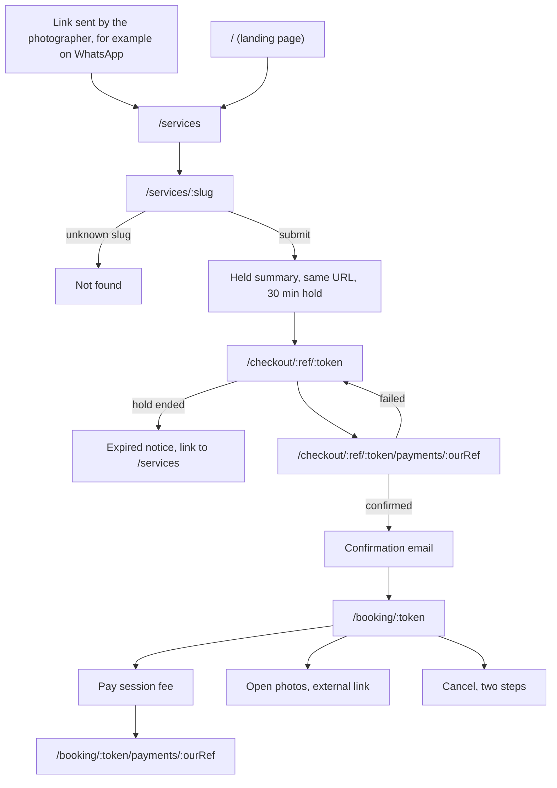
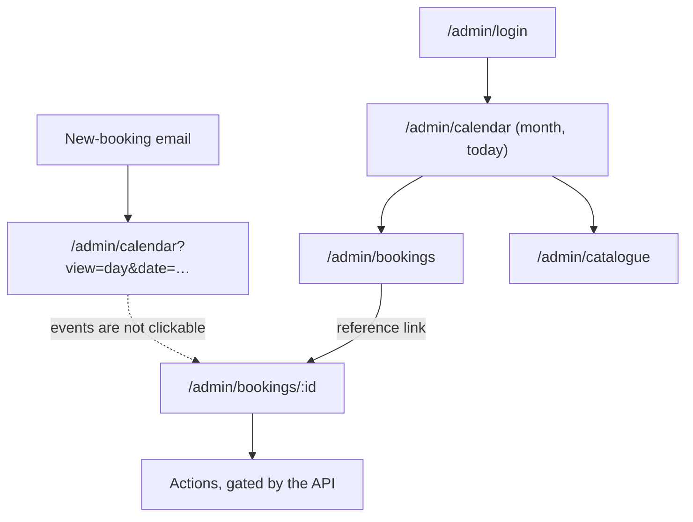
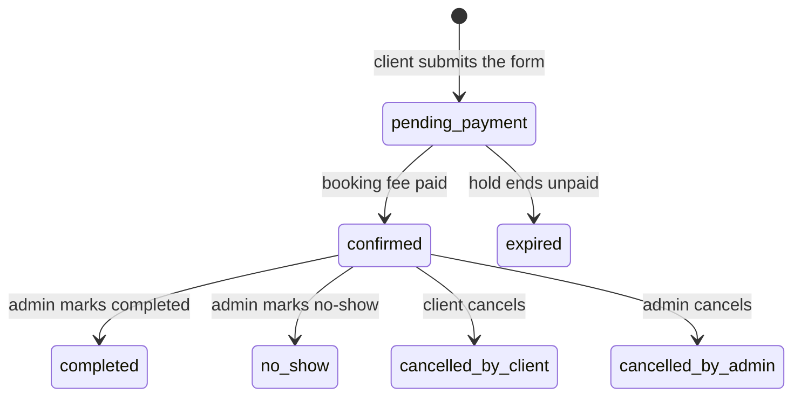

# Bookly user journeys: current and ideal

Written 2026-09-20 from the code at commit `7cf03ea` (branch `redesign/visual-only`, Phase 3 sections 1-2 applied). **Sections 1 and 7 were rewritten 2026-09-23, after the redesign finished, by walking the app in Chromium with `/api` mocked.** Sections 2-6, 8 and 9 still date from 2026-09-20. Originally, nothing here was run in a browser: the current journeys come from reading the routes, pages, backend routes and email templates; the ideal journeys come from `docs/brief.md`, `docs/specs_v2.md`, `docs/clien-answers.md` and `PRODUCT.md`, plus a few proposals that are marked as such.

**Status tags** used below: `[exists]` works today, `[partial]` works with a gap, `[missing]` not built. **Priority:** **Must** before launch, **Should** soon after or when cheap, **Could** worth considering, **Decision** needs an answer first.

---

## 1. Route map (current)

**Rewritten 2026-09-23, walked in a browser** (Chromium, the `/api` responses mocked) rather than read from the routes file. Every row below was opened; the claims in section 7 were each re-checked the same way.

### Public (no sign-in)

All of these sit inside a pathless layout route, `ClientShell`, added 2026-09-21. It puts a static header (the wordmark, one "Book now" link) and a footer on every client page, as **siblings** of the page's own `<main>` -- there is exactly one `main` per page. A skip link is the first focusable element.

| Route | Page | What it is |
|---|---|---|
| `/` | Home | **A landing page** (was an API-status stub with no links). Hero and call to action, a preview of the first three services the API lists, the four booking steps, four facts the code enforces -- including that the booking fee is not refunded -- and a closing call to action. No photographer name, logo, portfolio, testimonial or written-in price: none were supplied. |
| `/services` | ServiceList | Grid of active services with a "From X RWF" line. |
| `/services/:slug` | ServiceDetail | The whole booking funnel on one page. On success the same URL shows the "held" summary. An unknown or deactivated slug shows Not found. |
| `/checkout/:reference/:token` | CheckoutPage | Pay the booking fee. States: pay, paid, closed, expired, invalid link. |
| `/checkout/:reference/:token/payments/:ourRef` | PaymentProgressPage | Follows one payment until it settles (polls every 3 s, gives up after 10 min). |
| `/booking/:token` | BookingPage | The client's private booking page (the emailed "magic link"). |
| `/booking/:token/payments/:ourRef` | PaymentProgressPage | Same progress page, used for the session fee. |
| `*` | NotFound | "Page not found" with an "All services" link. Inside the shell too: someone who mistyped a URL is exactly who needs a way out. |

### Admin (one photographer)

| Route | Page | What it is |
|---|---|---|
| `/admin/login` | AdminLogin | Email and password, plus a **"Forgot your password?"** link to the reset page. Outside the shell. |
| `/admin/reset-password` | AdminResetPassword | **Exists now.** One route, two jobs: ask for the link, or choose the new password. The token arrives in the URL *fragment*, so it reaches no server log or referrer. Outside the shell, since it is used signed out. |
| `/admin` | (redirect) | Goes to `/admin/calendar`. |
| `/admin/calendar?view=month\|week\|day&date=YYYY-MM-DD` | AdminCalendar | FullCalendar of bookings, live holds and blocks. **Every event now opens something** -- a booking its own page, a block the page that edits it. Verified: one click on a month-view booking lands on `/admin/bookings/:id`. |
| `/admin/bookings?status=...&from=...&to=...&search=...` | AdminBookings | Filterable table, 25 per page, sorted by start time, newest first. |
| `/admin/bookings/:id` | AdminBookingDetail | One booking and every action on it. |
| `/admin/catalogue` | AdminCatalogue | Services, packages and add-ons (create, edit, activate, delete). |
| `/admin/availability` | AdminAvailability | **Exists now.** Weekly working hours, dated overrides and blocks on one page, with the spec 6.4 overlap warning. |
| `/admin/settings` | AdminSettings | **Exists now.** The five operating values: booking-fee rate, minimum notice, hold, buffer, delivery days. |

All `/admin/*` pages except login and reset sit inside `AdminLayout`, which redirects to login without a live session (a token in `sessionStorage`, valid 8 hours) and carries its own skip link and nav. The API refuses the data itself as well. The nav is five links: calendar, bookings, catalogue, availability, settings.

**Verified 2026-09-23:** a signed-out visitor who asks for `/admin/settings` lands on `/admin/login`, and **the URL carries nothing about where they wanted to go** -- gap 11 is still open.

### Not routes (no page exists)

`/privacy` (still answers with the Not found page, checked), and any tokenless "email me my booking link" lookup page. The latter is blocked, not merely unbuilt: see gap 19.

## 2. Current client journey

Clients are guests: no account. Their identity is the token in the URL.

**Corrected 2026-09-23:** that arrow used to be dotted, because `/` was a status stub with nothing leading to `/services`. It is a real link now -- the landing page carries three routes into `/services`, and the shell's header carries a fourth from every client page. The rest of this section still describes 2026-09-20.

### 2.1 Main path: book a shoot

| # | Route | What the client sees and does | Notes |
|---|---|---|---|
| 1 | `/services` | Reads the intro and picks a service card. | Arrives from a link the photographer sent, or types the address. |
| 2 | `/services/:slug` | Sees the cover image, description, then **1 Choose** a package (radio cards, nothing preselected) and optional add-ons. | Total updates as they choose. |
| 3 | same | **2 Pick a time.** Month calendar of days that have starts, then the times for the chosen day. Choosing a time re-checks it with the API ("Checking…"). | Kigali time, stated. Only free starts appear. |
| 4 | same | **3 Your details:** name, email, phone, location, number of people, special requests, consent tick. | Nothing is saved between visits. |
| 5 | same | The price summary shows total, booking fee (due now, 40% by default), session fee (after the shoot) and a non-refundable notice. **Submit** sits under it. | On phones the summary comes last, after the form. |
| 6 | same URL | Page becomes the **held summary**: reference, service, when, amounts, "held until HH:MM", non-refundable notice, **Pay** button. | The hold is 30 minutes (a setting). No email is sent at this point. |
| 7 | `/checkout/:ref/:token` | Sees reference, service, when, fee, hold time, notice. Picks a method (MTN MoMo is the only one offered), enters the Mobile Money number, presses Pay. | Airtel Money and card are not offered yet. |
| 8 | `…/payments/:ourRef` | Waits. The page says what is happening and never says "confirmed" until the provider's verified callback arrives. | The client approves the payment on their phone. |
| 9 | same | **Confirmed.** A heading and a line of text, plus the booking summary. | No link onward: the way back is the email. |
| 10 | (email) | Confirmation email with reference, when, where, amounts and the **View booking** link. | The admin gets a "new booking" email at the same time. |

### 2.2 Branches on the main path

| Where | Trigger | What the client sees | Then |
|---|---|---|---|
| Step 3 | Someone else took the time | "Just taken" alert, calendar refreshed | Picks another time. Details stay typed. |
| Step 5 | Server refuses a field | Field marked and focused | Fixes it. |
| Step 5 | Package or add-on changed under them | "Catalogue changed" message | Reviews the choice. |
| Step 7 | Hold ended | Expired notice with a link to `/services` | Starts again from scratch. |
| Step 7 | Booking already paid, or closed by the photographer | "Paid" or "This booking cannot be paid online. Please contact the photographer." | No contact detail is shown. |
| Step 7 | A payment is already in progress | Banner with a link to follow it | Follows it. |
| Step 8 | Payment declined or provider down | "Failed" with **Try again** | Back to the pay page. |
| Step 8 | Paid, but the slot was taken or the hold had ended | "Received" or "refund" text, amount stated | Waits for the photographer's refund. |
| Step 8 | Still unresolved after 10 min | "Still waiting" and **Check again** | Re-polls. Or closes the tab and waits for the email. |
| Any link | Wrong, expired or replaced token | "This link is not valid" | Dead end. |

### 2.3 Returning: `/booking/:token`

| Need | What is there | Notes |
|---|---|---|
| See what was booked | Status pill, details card, amounts card (total, paid, outstanding, refund due). | The status is text in a plain pill. The shared status look is planned for Phase 3 section 4. |
| Pay the session fee | Appears when the photographer has requested it: amount, method, phone, Pay, then the progress page. | Reached from the "session fee request" email button. |
| Get the photos | "Open your photos" (external link, opens in a new tab) with the expiry date. After expiry: "Contact the photographer for a new one." | The delivery email links straight to the external host. |
| Cancel | Two steps: a warning that the booking fee is not refunded, then confirm. Cancelled state shows the reason and any refund owed. | Only while the API says the booking can be cancelled. |
| Change the date | Nothing. | The spec sends the client to the photographer, but no contact detail is shown. |

### 2.4 Emails the client receives

| Email | Trigger | Link goes to |
|---|---|---|
| Booking confirmation | Booking fee confirmed | `/booking/:token` |
| Payment receipt | A payment is recorded | `/booking/:token` |
| Session-fee request | Admin presses "Request session fee" (pressing it again works as a reminder) | Pay button to `/booking/:token` |
| Photo delivery | Admin presses "Send photos" | The external host (WeTransfer, Drive…) |
| Reschedule | Admin moves the booking | `/booking/:token` |
| Cancellation | Client or admin cancels (spec 3.6) | n/a |
| Access-link resend | Admin resends the link (the old link stops working) | New `/booking/:token` |

There is no reminder before the shoot, no add-to-calendar file, and no SMS or WhatsApp.

### 2.5 Where the current client journey breaks or drags

1. **`/` leads nowhere.** A visitor who types the bare address sees an API-status page. Only a shared `/services` link works.
2. **No way to contact the photographer.** Three messages say to (`checkout:closed.body`, `booking:delivery.expired`, `booking:cancel.notCancellable`) and none shows how. Changing the date is also blocked on this.
3. **After the booking fee is paid, the page has no "view my booking" link.** The client is sent to their email; if it lands in spam they are stranded until the photographer resends the link. (The token in that URL is the checkout token, not the booking token.)
4. **Phones: the total is last.** The running total only appears after the details form.
5. **Nothing survives a lost hold.** An expired hold means re-choosing the package and re-typing every field; the funnel stores no draft.
6. **Only MTN MoMo.** The client answered "yes" to card and the brief requires Airtel Money.
7. **Consent links nowhere.** The tick box has no privacy notice to point at, because there is none.
8. **No reminder** before the shoot, though the client said reminders by SMS or WhatsApp "both would be ideal".

---

## 3. Current admin journey

One admin. Only the photographer signs in.

### 3.1 Sign in

| # | Route | What happens | Notes |
|---|---|---|---|
| 1 | `/admin/login` | Email and password. Wrong credentials, an unknown email and a locked account all show the same message. | A lockout also emails the admin. |
| 2 | → `/admin/calendar` | Always lands on the month view for today. | An email deep link to a specific day is lost here if the session had ended. |
| 3 | any admin page | Session lives in `sessionStorage`: a reload keeps it, closing the tab signs out. After 8 hours, or on any 401, back to login. | Login never returns you to where you were. |
| – | – | ~~**Forgot password:** nothing. The backend sends a reset email that links to `/admin/reset-password`, which shows "Page not found".~~ **Corrected 2026-09-23:** the login page carries a "Forgot your password?" link and `/admin/reset-password` is a real page. | |

### 3.2 Daily loop: a booking arrives

| # | Route | What the admin does | Notes |
|---|---|---|---|
| 1 | (email) | Reads the "new booking" alert and follows its link to `/admin/calendar?view=day&date=…`. | |
| 2 | `/admin/calendar` | Sees the day: bookings, live holds (dashed), blocks, a conflict marker where a booking overlaps a block. Week and day views add service, package and reference. Toolbar: previous, next, today, month, week, day. View and date are kept in the URL. | **Events cannot be clicked.** |
| 3 | `/admin/bookings` | Goes to Bookings, finds the booking (status toggles, from, to, search by reference, name, email or phone) and clicks its reference. | Default view is every booking ever, latest start first, 25 at a time, with "Load more". |
| 4 | `/admin/bookings/:id` | Reads Shoot, Client, Money, Payments, Delivery, Actions and Messages. | The money section shows total, collected, outstanding and refund due. |

### 3.3 Actions on a booking

The buttons that appear follow the API's own `actions` flags, and the API enforces them again.

| Action | Result |
|---|---|
| Reschedule (Kigali date-time) | Same booking, reference, link and payments; the old time is freed; the client is emailed. |
| Cancel (optional reason, two steps) | `cancelled_by_admin`; the time is freed; the booking fee is marked refund due; the client is emailed. |
| Mark completed / no-show | Status change. A no-show keeps the time occupied and owes no session fee. |
| Add or remove a post-shoot add-on | The outstanding session fee recalculates. |
| Request session fee | Emails the client the amount and a pay link. |
| Record a refund | Enter the reference of the refund made outside the system; nothing moves money. |
| Attach delivery link, set expiry, note; Send / Send again | Saves, then emails the client. The date defaults to 90 days. |
| Resend booking link | Issues a new link and kills the old one. |
| Messages | Read-only log of emails for this booking, with delivery status. |

A refused action (someone else changed the booking) replaces what is on screen with the current state.

### 3.4 Catalogue

`/admin/catalogue`: one card per service with its packages and add-ons, plus a card for add-ons offered on every service. Add, edit inline, activate or deactivate, delete (native confirm; refused if the item is in use). Fields include a per-service booking-fee override, cover-image URL and display order. Saving a package that is longer than any open day shows a warning.

### 3.5 What the admin cannot do in the interface

| Cannot do | Backend | Status |
|---|---|---|
| Change working hours, or open one Saturday | `/api/admin/working-hours` | Decided to build; not built. The seed is Mon-Fri 09:00-17:00. |
| Block a day or a time range | `/api/admin/blocks` | Decided to build; not built. The calendar shows blocks but cannot create them. |
| Change fee rate, notice, hold, buffer, delivery days | `/api/admin/settings` | Decided to build; not built. |
| Reset a forgotten password | `/api/admin/auth/password-reset/*` | Decided to build; not built. |
| Open a booking from the calendar | none needed | Decided to build; not built. |
| Create a booking for a client | none | Deliberate (spec 3.8, R-1): send the client the public URL. |
| See a notification log across all bookings | none | Only the per-booking Messages list exists. |

### 3.6 Where the current admin journey drags

1. **Four hops from alert to booking:** email → calendar day → Bookings → search → open. The calendar shows the booking but cannot open it.
2. **Bookings opens on everything.** No "upcoming", "today" or "needs attention" view; refund due and outstanding amounts are only visible row by row.
3. **The tab is the session.** On a phone, a discarded tab means signing in again, and login drops the page you came for.
4. **A forgotten password cannot be recovered** through the app.
5. **Setup is stuck:** without hours, blocks and settings screens, the photographer cannot open a weekend or take a day off without developer help. This blocks launch, since the brief sells event coverage.
6. **Post-shoot steps are separate controls with no next-step hint** (complete, add-ons, request fee, paste link, send). They work; they are just unguided.

---

## 4. Booking lifecycle (shared by both journeys)

The diagram shows only the transitions the spec names; the API decides which are allowed at any moment (`canCancel`, `canReschedule`, …). Money rules: the booking fee is not refunded if the client cancels; it is refunded in full if the photographer cancels (a developer-proposed default, spec A-5); refunds are made outside the system and only recorded in it.

---

## 5. Ideal client journey

The target keeps `PRODUCT.md`'s principles: a slot is never sold twice; say what is owed and when; no account, one link back; nothing claimed that is not real; nothing says "confirmed" until the API does. It adds nothing that needs invented content.

| Stage | Ideal | Route | Vs today | Priority |
|---|---|---|---|---|
| **Arrive** | Any address the client is likely to have lands somewhere useful. Interim: `/` goes straight to `/services`. Later: a real landing page in the photographer's own words (no invented proof). | `/` | `[missing]` | **Must** (interim), **Decision** (landing copy) |
| **Choose** | Real service names, prices and cover images. A package and add-ons chosen with the price always in view: on phones a compact bar with total and "due now" that follows the client, without moving the form's reading order. | `/services/:slug` | `[partial]` | **Must** (content, R-6), **Should** (bar) |
| **Pick a time** | Only truly free starts, in Kigali time. If the month is empty, say when the next opening is and jump to it. | same | `[partial]` (empty month only says so) | **Could** |
| **Details** | Only what the photographer needs. A hint for non-Rwandan numbers. The consent tick links to a plain privacy notice. | same, `/privacy` | `[partial]` (no notice) | **Must** (spec 4.1) |
| **Review and hold** | Total, booking fee due now, session fee later, non-refundable line before the button. After submit, the reference and the hold time. If the hold is lost, keep what the client typed. | same | `[partial]` (nothing kept) | **Should** |
| **Pay** | Every method the client was promised: MTN MoMo now; Airtel Money and card after the Flutterwave cutover. The Mobile Money number is prefilled from the phone given at booking, editable. | `/checkout/…` | `[partial]` (MTN only, no prefill) | **Should** (methods), **Could** (prefill) |
| **Wait** | Honest states only (as today): pending, still waiting, failed, refund, received. | `…/payments/:ourRef` | `[exists]` | – |
| **Confirmed** | Confirmed state includes a **View my booking** button, so the client does not depend on an email arriving. The confirmation email also carries the photographer's contact detail. | `…/payments/:ourRef`, `/booking/:token` | `[missing]` | **Should** (needs the API to hand over the booking link once) |
| **Before the shoot** | One reminder the day before, with when, where and the contact detail. Optional add-to-calendar file. | email | `[missing]` | **Could**, **Decision** (email only, or SMS / WhatsApp: the client said "both") |
| **Change or cancel** | Cancel with the fee warning (as today). To change the date, the client can reach the photographer in one tap. | `/booking/:token` | `[partial]` (no contact detail) | **Must** (contact channel) |
| **After the shoot** | Session-fee request email → pay on the booking page → a clear "paid" state with a way back to the booking. Photos arrive by email and on the booking page, with the expiry date. When the link has expired, a one-tap way to ask for a new one. | `/booking/:token` | `[partial]` | **Should** |
| **Lost link** | The photographer can resend it (as today). Optional self-service "email me my link". | `/booking/…` | `[exists]` (admin resend only) | **Could**, **Decision** (abuse and privacy) |
| **Language** | English at launch. French later, using the existing translation layer and no new route structure. | all | – | **Could** (later) |

### Ideal client path in short

Link or `/` → `/services` → pick a service → package and add-ons (total in view) → time → details and consent → held for 30 minutes → pay → wait → **View my booking** → email with reference and contact → reminder → shoot → session-fee email → pay → photos → done. Every step names what is owed and when, works on a phone, and never says "confirmed" before the API does.

---

## 6. Ideal admin journey

The target serves one non-technical person, on a phone and a desktop: few steps, plain words, and the next action always visible.

| Stage | Ideal | Route | Vs today | Priority |
|---|---|---|---|---|
| **First-time setup** (once) | Sign in → set working hours (including weekends and one-off open days) → confirm the five operating values → check the catalogue → block any time off. | new: availability and settings pages; `/admin/catalogue` | hours, blocks, settings `[missing]`; catalogue `[exists]` | **Must** (decided, `docs/redesign-pending.md` section 1) |
| **Sign in and recover** | "Forgot password" on the login page → reset email → `/admin/reset-password` → sign in. After any sign-in, return to the page that was asked for. Decide how long a phone stays signed in. | `/admin/login`, `/admin/reset-password` | `[missing]` | **Must** (reset), **Should** (return-to), **Decision** (`sessionStorage` vs longer) |
| **Notice a booking** | The email link opens the day; the booking is one click away. Two steps from alert to booking. | `/admin/calendar?…` → `/admin/bookings/:id` | `[partial]` (four hops) | **Must** (decided) |
| **Read the calendar** | Month, week and day; bookings, holds and blocks distinct without colour alone; conflict markers. On a phone, open in day view. | `/admin/calendar` | `[partial]` | **Should** |
| **Manage availability** | Create a block from the calendar (full day, range, or time range; private reason). Overlap with a confirmed booking warns and asks to confirm. Edit and delete blocks. Open one Saturday. | calendar and availability page | `[missing]` | **Must** (decided) |
| **Work the list** | Bookings opens on what needs attention: upcoming first, with filters for refund due, outstanding and pending payment. | `/admin/bookings` | `[partial]` (everything, latest first) | **Should** |
| **Change a booking** | Reschedule or cancel with a reason (as today), and a clear result: what the client was emailed, what is owed back. | `/admin/bookings/:id` | `[exists]` | – |
| **Post-shoot** | Complete → add-ons → request session fee → (paid alert) → paste link and expiry → send. Each step shows what is next. | `/admin/bookings/:id` | `[exists]` (unguided) | **Could** |
| **Money follow-up** | A short queue of refunds to make and fees still owed, each linking to its booking. Record the refund reference in one form (as today). | `/admin/bookings`, detail | `[partial]` | **Should** |
| **Content** | Edit services, packages, add-ons and fee overrides; deactivate instead of deleting. | `/admin/catalogue` | `[exists]` | – |
| **Support** | Resend a client's link; see what emails went to a booking and whether they arrived. | detail | `[exists]` (per booking) | **Could** (global log) |
| **Offline enquiries** | The photographer sends the public URL by WhatsApp (no admin booking form). Revisit only if clients do not follow it (R-1). | public URL | `[exists]` by design | **Decision** later |

### Ideal daily loop in short

Email or bookmark → **Bookings** opens on upcoming and unpaid → open a booking → act (reschedule, cancel, request fee, send photos) → done. Weekly: block time off from the calendar. Occasionally: hours, settings, catalogue.

---

## 7. Gap list: current to ideal

**Rewritten 2026-09-23.** Each row was re-checked against the running app, not against the plan. "Closed" means it was opened in a browser and seen to work.

### Closed since this list was written

| # | Gap | How it closed | Checked |
|---|---|---|---|
| 1 | Working hours, blocks and settings pages | Built as feature work (`d02bd41`), designed in `pages/{availability,settings}.md`, restyled in Section 5 | `/admin/availability` and `/admin/settings` both render, titled "Availability" and "Settings" |
| 2 | Password reset page and "Forgot password" link | Built in `d02bd41`, designed in `pages/admin-reset-password.md`, restyled in Section 5 | `/admin/login` carries one "Forgot your password?" link to `/admin/reset-password`, which renders "Reset your password" |
| 3 | Calendar event opens the booking | Built in `d02bd41` | One click on a month-view booking landed on `/admin/bookings/b9` |
| 6 | `/` leads somewhere useful | A real landing page shipped 2026-09-21, ahead of the interim redirect this row proposed | `/` titles "Book a photographer, and know the price before you do.", carries three routes into `/services`, and wears the shell's header and footer |

Gap 6's **Decision** half is not closed: the landing copy is the developer's, written to state only what the code enforces. Replacing it with the photographer's own words is still open, and the keys are `landing:*` in `en.json`.

### Still open

| # | Gap | Journey | Needs | Priority | Checked 2026-09-23 |
|---|---|---|---|---|---|
| 4 | Photographer contact channel | Client | Real details from the client; copy | **Must** | No contact detail appears on `/`, `/services` or a service page. Three messages still tell clients to "contact the photographer" |
| 5 | Privacy notice and consent link | Client | Page, copy; erasure routine (Task 23) | **Must** | `/privacy` still answers with the Not found page |
| 7 | Real service names, prices, images | Client | Content from the client (R-6) | **Must** | Unchanged; the landing preview deliberately reads them from the API rather than hard-coding any |
| 8 | "View my booking" after the fee is paid | Client | API returns the booking link once; a button | **Should** | The `confirmed` view on the progress page has a heading and body and **no link onward** |
| 9 | Airtel Money and card | Client | Flutterwave adapter (Task 25) | **Should** | Unchanged |
| 10 | Google Calendar mirror | Admin | Task 22 | **Should** | Unchanged |
| 11 | Sign in returns to the page asked for | Admin | Small code change | **Should** | Asking for `/admin/settings` signed out lands on `/admin/login` with no record of the destination |
| 12 | Bookings opens on "needs attention"; refund and unpaid filters | Admin | List defaults and filters | **Should** | Unchanged |
| 13 | Phone: running total in view; calendar in day view | Both | Design decision; code | **Should** | The calendar opens in **Month** view on a Pixel 7, not day view |
| 14 | Keep the form after a lost hold | Client | Draft in memory or storage | **Should** | Unchanged |
| 15 | Confirm working hours with the photographer | Admin | An answer, then the hours page | **Must** | The page now exists to receive the answer; the answer does not |
| 16 | Reminder before the shoot | Client | Email, maybe SMS / WhatsApp | **Could** / **Decision** | Unchanged |
| 17 | Add-to-calendar file | Client | Small backend addition | **Could** | Unchanged |
| 18 | Guided post-shoot steps | Admin | Copy, layout | **Could** | Unchanged |
| 19 | Self-service lost-link resend | Client | **A public endpoint that does not exist** | **Could** / **Decision** | Checked in the backend 2026-09-21: the only resend is `POST /api/admin/bookings/:id/resend-link`, inside `adminRouter` behind the session guard. No public route takes an email or a reference. **This blocks a second header link.** The client shell was designed with "My booking" beside "Book now"; on the user's decision it shipped with one link rather than a page that cannot work. When the endpoint exists -- answering 202 whatever the input, like the admin password reset, so it cannot reveal who has a booking -- the link and the page follow |
| 20 | French | Both | Content and routes | **Could** (later) | Unchanged |

### Ideal-journey steps the app still cannot do

Reading sections 5 and 6 against the walked app, these remain impossible rather than merely rough:

- **Client, "Change or cancel":** cancelling works, but "reach the photographer in one tap" cannot be done at all -- there is no contact detail anywhere in the product (gap 4).
- **Client, "Details":** the consent tick cannot link to a privacy notice, because there is no notice (gap 5).
- **Client, "Confirmed":** the client cannot get from a successful payment to their booking without the email arriving (gap 8).
- **Client, "Lost link":** a client who loses the email has no self-service route back; only the photographer can resend (gap 19).
- **Client, "Before the shoot":** no reminder is sent (gap 16).
- **Admin, "Sign in and recover":** recovery works end to end now; the "return to the page that was asked for" half does not (gap 11).
- **Admin, "Work the list":** the list still opens on everything, newest first, rather than on what needs attention (gap 12).

## 8. Open questions

1. Is the admin used on a phone? If yes, gaps 3, 11 and 13 move from Should to Must.
2. ~~Can the interim `/` redirect to `/services` go ahead, or should `/` wait for a landing page?~~ **Overtaken 2026-09-21:** a real landing page shipped instead of the redirect. What remains is whether its copy should be replaced with the photographer's own words (`landing:*` in `en.json`).
3. What are the photographer's contact details, and where should they appear (booking page, expired and closed messages, emails)?
4. Are reminders wanted, and by email only, or SMS and WhatsApp too?
5. Should a phone stay signed in for the token's 8 hours, or should closing the tab keep signing out?
6. ~~Do working hours and blocks share one admin page?~~ **Answered 2026-09-21: yes**, one Availability page, because between them they answer one question -- when can a client book?

## 9. Confidence

- **High:** routes, page contents, admin actions, statuses, the email templates and their links, the sign-in behaviour, the bookings list order (all read in code).
- **Medium:** email trigger timing and the cancellation email recipients (from the spec and template names, not exercised).
- **Checked in a browser 2026-09-23** (Chromium at 1280px and emulated Pixel 7, `/api` mocked): every route in section 1 renders, and every section 7 row marked "checked" was exercised. This covers sections 1 and 7 only.
- **Still not checked:** behaviour against a running backend and database, and on real hardware rather than emulation. Sections 2-6 remain as read from the code on 2026-09-20 and were not re-walked.
